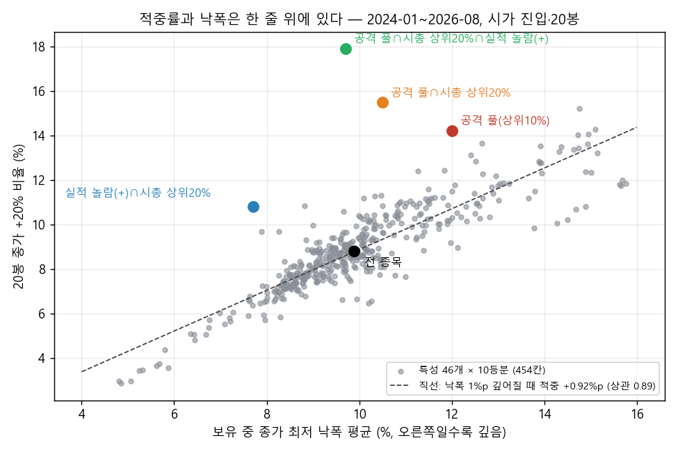

# +20% 목표 — 넓게 다시 보기 (Claude, 2026-10-04 새벽 · 탐색 · 판정·채택 아님)

> Codex 1차(`handoff/REPLY_20261003_target20_research.md`)·후속(`handoff/REPLY_20261004_target20_followup.md`)을 이어받아, Codex 가 안 한 다섯 갈래를 넓혀 본 기록.
> 계산 전 사양: `target20_wide_20261004/PLAN.md`. 코드·결과: 같은 폴더(`e1`~`e6`, `*_out.txt`, `*_summary.csv`). 운영 코드·DB·사전등록·판정 변경 없음(읽기 전용).
> 같은 3년 패널을 또 본 것이라 **독립 검증이 아니다.** 아래 숫자는 전부 실측이고, '해석'·'제안'이라고 쓴 줄만 내 의견이다.

## 1. 먼저 답
> **[10/04 낮 정정 — 아래 E4d]** 실적 신호는 남지만 ① "대형주에서 +4.9%p"의 3분의 2는 실적이 아니라 KOSPI 대형주 효과였고(같은 시장·시총끼리 견주면 +1.44%p [−0.06, +3.11]) ② 2024년은 0 근처라 두 해(2025·26)짜리 관측이며 ③ 나쁜 실적을 피하는 쪽(−1.0%p, 세 연도 모두)이 더 고르다. 아래 1번과 '사후 조합'은 이 정정을 얹어 읽을 것.
- **세 조건을 한 목록이 다 채우는 방법은 이번에도 없다.** 특성 46개를 10등분한 454칸에서 "+20% 적중률"과 "보유 중 낙폭"은 거의 한 줄 위에 있다(상관 0.89 — 낙폭이 1%p 깊어질 때 적중 +0.92%p). 적중만 올리고 낙폭은 그대로인 특성은 못 찾았다. "다음날 오르는 비율"은 어떤 칸도 50%를 못 넘었다(최고 47.4%).
- 다만 **그 줄에서 위로 벗어난 곳이 세 군데** 있었고, 서로 겹쳐도 효과가 남았다:
  1. **실적 공시(전년 동기보다 영업이익이 크게 늘어난 종목)** — 공시 뒤 20봉 초과 +1.7%p, 60봉까지 계속 벌어짐. 분기 묶음 10개 중 8개 양(+). Codex 가 "자료가 없어 못 한다"고 한 것인데 10/04 00:45 에 DART 과거 재무 수집이 끝나서 가능해졌다.
  2. **공격형 후보 안에서 대형·거래 많은 쪽** — 세 연도 모두 적중↑·낙폭↓·평균↑.
  3. **+20% 지정가 매도** — 공격형 목록에서 "실제로 +20%에 판 거래"가 20% → 42%. 대신 평균 수익은 줄어든다(Codex 와 같은 맞교환).
- 목표 3(하락장 덜 떨어지고 상승장 더 오름)은 **목록이 아니라 계좌 노출 쪽**에서만 모양이 나왔다: "코스닥이 120일선 위일 때만 보유". 단 이 기간엔 사실상 큰 상승 한 번(2025-04~2026-05)을 탄 것이라 근거는 약하다.
- 셋을 합친 사후 조합 **"실적 놀람(+) ∩ 시총 상위 20% → 고점 근접순 10개"** 는 타이밍 없이도 상승 구간 포획 0.99 · 하락 구간 포획 0.53(지수 +78% 동안 +115%, 최대 낙폭 −30% vs 지수 −38%), 세 연도 모두 양(+). **결과를 본 뒤 만든 조합**이므로 가설이다 — 앞으로 자료로만 확인할 수 있다.

## 2. 한 일과 규약
- 패널·가드·후보 3개(거래대금 상위10 / 고베타+고점 근접 = '공격형' / 가격4요소)는 Codex 코드를 그대로 불러 썼다 → 숫자가 맞물린다(공격형 20봉 평균: 2025 +7.37% · 2026 −1.03% — Codex 후속 표의 +7.36 · −1.02 와 일치).
- 목록일 **2024-01-02~2026-08-25, 644일**(Codex 는 2025~26 400일). 연도 3개를 항상 따로 봤다. 진입 = 다음날 시가, 왕복 비용 0.5%, CI = 날짜 20일 블록 2,000회(사건은 날짜 묶음 재추출).
- 주문 흉내(돌파 매수·눌림 지정가·지정가 익절·장중 손절)는 일봉 고가·저가로 계산. 같은 날 손절·익절이 둘 다 닿으면 손절 먼저(보수적). 실제 호가·체결 재현은 아니다.
- 검증: 주문 계산(벡터)을 표본 600건에서 단순 반복문으로 다시 계산 → 불일치 0건(`verification.json`). 실적 분기값은 삼성전자 2024년 4개 분기로 눈 대조(6.61 / 10.44 / 9.18 / 6.49조).

## 3. 결과

### E1. 특성 지도 (전 종목 85만 종목·일)
| | 20봉 종가 +20% | 5~20봉 닿음 | 다음날 상승(시가→종가) | 평균 수익 | 종가 최저 낙폭 |
|---|---|---|---|---|---|
| 전 종목 | 8.8% | 15.4% | 42.6% | −0.77% | −9.9% |
| 적중 최고 칸(52주 저점 대비 가장 많이 오른 10%) | 15.2% | 26.6% | 42.0% | −1.31% | −14.8% |
| 공격 풀(고베타+고점 점수 상위 10%) | 14.2% | 23.5% | 42.6% | +0.48% | −12.0% |
| 공격 풀 ∩ 시총 상위 1/5 | 15.4% | 23.0% | 44.6% | +3.35% | −9.2% |
- 적중률 상위 칸은 전부 "이미 많이 오른·변동 큰" 쪽이고, 평균 수익은 오히려 음(−)이다. **적중률이 높다 ≠ 돈이 된다.**
- 평균 수익이 양(+)인 칸은 시총·주가·유동성 최상위(+1.1~+1.6%)뿐. 공격 풀 안에서도 같은 방향이고 세 연도 모두 그렇다(풀 평균 −2.27 / +3.33 / +0.37% → 시총 상위 1/5: +0.59 / +6.20 / +3.25%). 단 2024~26 은 대형주가 끈 장이어서 시기 효과일 수 있다(해석).
- 덤: 목록 다음날 수익을 쪼개면 **밤사이(종가→시가) +0.19%, 장중(시가→종가) −0.18%**(공격형: +0.45% / −0.13%). "다음날 시가에 사면 그날 종가엔 밀려 있는" 날이 더 많은 이유다. 목록이 저녁에 나오므로 밤사이 몫은 잡을 수 없다.

### E2. 진입 주문 방식 (공격형, 청산은 20봉 보유)
| 진입 | 체결 비율 | 거래당 평균 | 10자리 평균(빈 자리 현금) | 시가 진입 대비 [95%] | 둘째 날 종가가 매수가 위 |
|---|---|---|---|---|---|
| 다음날 시가(기준) | 99.7% | +2.37% | +2.36% | — | 45.0% |
| 돌파 매수(목록일 고가 위, 1일) | 51.2% | +2.51% | +1.29% | −1.07 [−2.79, +0.91] | 45.8% |
| 돌파 매수(3일 유효) | 68.2% | +2.35% | +1.60% | −0.76 [−1.90, +0.54] | 45.9% |
| 눌림 지정가(종가 −3%) | 53.0% | +1.82% | +0.96% | −1.40 [−3.36, +0.66] | 46.4% |
| 다음날 양봉 확인·종가 매수 | 36.5% | +3.15% | +1.15% | −1.21 [−3.54, +1.26] | 45.4% |
- **어떤 진입 방식도 "사고 나서 오르는 비율"을 못 바꿨다**(45~46%). 거래당 평균이 조금 나은 것(돌파·양봉 확인)은 구간이 0 을 걸치고, 놓친 거래만큼 자리 수익은 줄었다. 다른 후보 3개도 같은 모양. Codex 의 "첫날 양봉 확인은 구분력이 없다"를 주문 방식 4개로 넓혀도 같은 결론.

### E3. 청산 주문 방식 (다음날 시가 진입)
| 후보 | 청산 | 실제 +20% 청산 | 거래당 평균 | 중앙값 | 손실 거래 | 낙폭 | 평균 보유 |
|---|---|---|---|---|---|---|---|
| 공격형 | 20봉 보유 | 19.9% | +2.37% | −2.96% | 55% | −17.4% | 20봉 |
| 공격형 | **지정가 +20%** | **42.2%** | +1.42% | +2.86% | 47% | −14.9% | 15봉 |
| 공격형 | +20% 지정가·장중 −10% 손절 | 30.9% | +0.04% | −10.5% | 63% | −9.1% | 8봉 |
| 공격형 | +20% 지정가·10봉째 손실이면 정리 | 37.3% | +0.91% | −2.63% | 56% | −12.6% | 11봉 |
| 거래대금 상위10 | 20봉 보유 → 지정가 +20% | 15.1% → 28.3% | +2.80 → +1.74% | −0.11 → +1.12% | 50 → 47% | −12.3 → −11.3% | |
- 지정가 +20%의 연도별 적중: 2024 34.5% · 2025 44.7% · 2026 50.2%. Codex 의 "종가 확인 뒤 다음 시가"(33.1%)보다 높은 것은 장중에 닿은 것을 그 자리에서 팔기 때문.
- **"5~20일 안에 +20%"라는 목표 글자 그대로라면 이게 가장 가까운 답**이다: 10개 중 4개는 +20%에 팔린다. 하지만 나머지 6개의 평균은 −12.6%라 거래당 평균은 +1.4%에 그치고, 20봉 보유(+2.4%)보다 낮다(차이 −0.94 [−2.72, +0.97], 구분 안 됨).
- 손절은 전부 평균을 깎았다(장중 −10% 손절: 손실 거래 63%, 중앙값 −10.5%). 변동 큰 종목은 −10%를 찍고 돌아오는 일이 잦다.

### E4. 사건 후보 (대조 = 같은 날 전 종목, 20봉 보유)
| 사건 | 건수(날짜) | +20% | 대조 +20% | 초과 평균 [95%] | 낙폭(대조) | 연도 2024/25/26 초과 |
|---|---|---|---|---|---|---|
| **실적: 영업이익 증가분 ≥ 시총 1%** | 3,440 (131) | 8.7% | 7.5% | **+1.69 [+1.00, +2.45]** | −12.3 (−13.5) | +1.23 / +2.30 / +1.55 |
| 실적: 흑자 전환 | 1,236 (94) | 10.3% | 7.7% | +1.82 [+0.61, +3.17] | −13.4 (−13.4) | +0.31 / +3.05 / +2.00 |
| 실적: YoY ≥ +50% | 2,383 (127) | 8.5% | 7.4% | +1.58 [+0.60, +2.65] | −12.8 (−13.8) | +1.31 / +2.09 / +1.36 |
| 실적: 전체(놀람 무관) | 13,103 (182) | 7.7% | 7.7% | +0.01 [−0.22, +0.27] | | |
| 실적: 감소분 ≥ 시총 1% | 2,873 (113) | 6.4% | 7.9% | −0.98 [−1.75, −0.09] | | −0.33 / −1.36 / −1.38 |
| **자사주 취득 공시** | 1,109 (502) | 6.6% | 8.6% | +1.44 [+0.66, +2.24] | **−8.8 (−11.9)** | +1.64 / +0.85 / +1.89 |
| 무상증자 공시 | 87 (78) | 16.1% | 8.2% | +4.29 [−0.87, +9.89] | −14.3 (−12.4) | 표본 작음 |
| 상한가 마감 다음날 | 3,060 (625) | 12.8% | 9.9% | **−8.75 [−10.49, −6.97]** | −30.6 (−12.5) | −8.4 / −8.6 / −9.0 |
| 60일 만의 첫 신고가 + 거래량 2배 | 2,202 (559) | 13.3% | 9.6% | −1.38 [−2.67, +0.15] | −16.7 (−11.4) | −2.0 / −0.7 / −1.6 |
| 유상증자 공시 | 559 (367) | 12.2% | 8.8% | −2.95 [−4.96, −0.63] | −18.4 (−12.0) | −4.1 / −0.9 / −4.2 |
| 전환사채 공시 | 981 (486) | 12.6% | 8.8% | −1.65 [−3.41, +0.05] | −17.2 (−12.1) | −2.5 / −0.6 / −2.1 |

실적 놀람(영업이익 증가분 ÷ 시총) 크기별 — 같은 날 전 종목 대비 초과 %p:
| 놀람 | n | 5봉 | 10봉 | 20봉 [95%] | 40봉 | 60봉 [95%] |
|---|---|---|---|---|---|---|
| ≤ −3% | 1,099 | −0.41 | −1.14 | −1.54 [−2.91, −0.12] | −1.81 | −2.16 [−3.45, −0.91] |
| −1~0% | 3,003 | −0.36 | −0.35 | −0.87 [−1.77, −0.08] | −1.69 | −2.05 [−3.25, −0.82] |
| 0~+1% | 3,309 | +0.05 | −0.06 | −0.05 [−0.67, +0.55] | −0.31 | +0.33 [−0.74, +1.71] |
| +1~+3% | 1,886 | +0.32 | +0.45 | +1.33 [+0.70, +2.09] | +2.82 | +3.51 [+1.96, +5.51] |
| ≥ +3% | 1,194 | +1.45 | +1.39 | +2.71 [+1.26, +4.39] | +3.88 | +3.45 [+1.36, +5.91] |
- **크기 순서대로 줄을 선다**(나쁜 실적 −, 좋은 실적 +, 무관 0). 분기 묶음으로 보면 20봉: 10개 중 8개 양(+), 묶음 평균 +1.93%p(표준오차 0.53) · 60봉: 8개 양(+), +3.39%p(0.77). 이번 연구에서 **'미리 정한 통과 기준'(세 연도 같은 방향 + CI 가 대조 대비 0 을 안 걸침)을 양(+) 쪽으로 넘은 것**은 실적 놀람(+) 3종과 자사주 취득뿐이다(음(−) 쪽으로 넘은 것: 상한가 직후·유상증자).
- 시총별(사후 분할): 놀람(+) ∩ 시총 상위 20% 는 20봉 +4.51 [+1.59, +7.45] · 60봉 +10.86%p(n 482), 하위 50% 는 +1.52 · +1.10.
- 하지만 **+20% 적중률은 9~11%로 거의 안 오른다.** 실적 신호는 "급등 목록"이 아니라 "꾸준히 시장보다 나은 목록"(목표 2 쪽)이다.
- "시장 반응(+3%)을 확인한 뒤 하루 늦게 사기"는 초과가 더 크지 않았다(구간이 0 을 걸침) — E2 와 같은 결론.
- 상한가·신고가 추격·증자·전환사채는 +20% 적중은 높지만 평균은 음(−) → **피할 목록**. Codex 의 "희석 공시 회피가 공격형을 못 고쳤다"와 모순 아님(공격형 상위 10개엔 그런 종목이 원래 드묾).

### E4c. '처음 알려진 날' 기준으로 다시 (10/04 오전 추가 — 사용자 승인으로 DART 공시목록 날짜 수집)
수집: `dart_history/collect_disclosure_dates.py` — 정기보고서 원본·정정(4.4만 건), 공정공시(9,165건, 그중 잠정실적), 손익구조 변동 공시(8,260건). 2023-04~2026-10, 호출 2,241건. 숫자는 안 받고 날짜·제목만.
- 사건 32,725건 중 **33%가 정기보고서보다 먼저 알려져 있었다**(시총 상위 20%는 77%, 하위 50%는 34%). 앞선 거래일 수 중앙값 14일. 저장돼 있던 접수일이 정정본 것이었던 사건은 2,663건.

| 기준 날짜 | 대상 | n (날짜 수) | 20봉 초과 [95%] | 60봉 초과 [95%] | 분기 묶음 양(+) |
|---|---|---|---|---|---|
| 정기보고서 원본 접수일 | 놀람 ≥ +1% | 3,316 (105) | +1.83 [+1.10, +2.61] | +3.36 [+1.98, +5.15] | 8/10 |
| **처음 알려진 날** | 놀람 ≥ +1% | 3,260 (306) | +1.67 [+0.89, +2.51] | +3.70 [+2.40, +5.30] | 9/11 |
| 처음 알려진 날 | 놀람 ≤ −1% | 2,963 (289) | −1.15 [−1.74, −0.44] | −2.42 [−3.48, −1.23] | 1/10 |
| 처음 알려진 날 | 전체(놀람 무관) | 12,909 (394) | −0.11 [−0.58, +0.40] | −0.22 [−0.98, +0.71] | 4/11 |
| 처음 알려진 날 | 놀람 ≥ +1% ∩ 시총 상위 20% | 552 (197) | **+4.91 [+3.03, +6.78]** | +8.66 [+6.02, +11.19] | 8/10 |
| 처음 알려진 날 | 놀람 ≥ +1% ∩ 시총 50~80% | 869 (213) | +1.95 [+0.82, +3.15] | +4.96 [+2.35, +8.02] | 8/11 |
| 처음 알려진 날 | 놀람 ≥ +1% ∩ 시총 하위 50% | 1,839 (224) | +0.56 [−0.49, +1.81] | +1.62 [+0.06, +3.76] | 6/10 |

- **날짜를 바로잡아도 신호는 그대로 남는다.** 사건 날짜가 105일 → 306일로 흩어져 "분기마다 며칠에 몰린 우연"일 가능성은 줄었다. 대형주 구간이 좁아졌다([+1.19, +7.47] → [+3.03, +6.78]).
- 같은 사건을 두 날짜로 사 보면(먼저 알려진 사건만, 놀람 ≥ +1%): 처음 알려진 날 +2.14 [+1.16, +3.21] vs 정기보고서 날 +2.46 [+1.38, +3.59]. **2~3주 늦게 사도 초과가 비슷하다** = 발표 직후 반짝이 아니라 몇 달에 걸친 느린 흐름이다. 그래서 "대형주 효과는 이미 알려진 뒤라 가짜"라는 걱정은 맞지 않았다 — 알려진 뒤에도 계속 간다.
- 약해진 곳: 2024년(처음 알려진 날 기준 +0.21%p — 원본 접수일 기준은 +1.09). ~~시총 하위 50%는 약하다 · 효과는 중·대형주에 있다~~ → **E4d 에서 정정**(대조군을 시장·시총별로 맞추면 반대로 나온다).
- 근사: 놀람 값은 정기보고서 숫자를 썼다(잠정치 ≈ 확정치 가정). 손익구조 변동 공시는 연간 기준인데 4분기 3개월 값으로 대신했다.
- 운영으로 옮긴다면: 잠정실적 날짜에는 숫자를 API 로 못 받는다(본문 파싱 필요). **정기보고서 접수일 기준이면 지금 수집기로 되고 초과도 비슷하다** → 사양을 동결한다면 정기보고서 기준이 싸고 충분하다(해석).

### E4d. 대조를 '같은 시장·같은 시총 구간'으로 — **앞의 해석 정정** (10/04 낮, Codex 조건 탐색의 시장 분리 지적 반영)
Codex `handoff/REPLY_20261004_condition_sweep.md` 가 "시총 상위 20%는 KOSPI 에서만 좋았다(+1.70%p), KOSDAQ 은 아니다"를 보였다. 내 E4·E4c·E6 은 시총 순위를 두 시장을 합쳐 매겼고(상위 20% 사건 552건 중 KOSPI 521건) 대조도 두 시장 합친 전 종목이었다. 그래서 대조를 **같은 날·같은 시장·같은 시총 구간**으로 바꿔 다시 쟀다(`e4d_matched_control.py`, 사건은 E4c 그대로).

| 놀람 ≥ +1% (처음 알려진 날) | n | 20봉 초과 [95%] (종전 대조) | 60봉 초과 [95%] | 묶음 양(+) | 연도 2024/25/26 |
|---|---|---|---|---|---|
| 두 시장 합 | 3,260 | +1.55 [+0.79, +2.36] (+1.67) | +3.76 [+2.43, +5.34] | 7/11 | +0.09 / +2.19 / +2.77 |
| KOSPI | 1,413 | +1.19 [+0.25, +2.12] (+2.71) | +2.14 [+0.60, +3.73] | 6/11 | +0.05 / +2.14 / +1.68 |
| KOSDAQ | 1,847 | +1.83 [+0.93, +2.96] (+0.87) | +4.99 [+2.89, +7.63] | 9/10 | +0.13 / +2.23 / +3.55 |
| KOSPI 시총 상위 20% | 521 | **+1.44 [−0.06, +3.11]** (+4.66) | +2.78 [+0.48, +5.17] | 7/10 | −0.59 / +1.45 / +5.01 |
| KOSDAQ 시총 하위 50% | 1,419 | +1.62 [+0.58, +2.95] (+0.40) | +4.37 [+2.28, +7.19] | 9/10 | −0.01 / +2.22 / +2.75 |
| (반대쪽) 놀람 ≤ −1% 두 시장 합 | 2,963 | −1.01 [−1.49, −0.48] | −1.90 [−2.87, −0.87] | 1/10 | −0.87 / −1.23 / −0.87 |
| (대조) 전체, 놀람 무관 | 12,907 | −0.22 [−0.51, +0.09] | −0.22 [−0.79, +0.44] | 3/11 | |

- **실적 놀람 효과 자체는 남는다**(+1.55%p, 60봉 +3.76%p — 대조를 바꿔도 거의 같다).
- **정정 1 — "대형주에서 +4.9%p"의 3분의 2는 실적이 아니라 'KOSPI 대형주였다'는 효과였다.** 같은 KOSPI 대형주끼리 견주면 +1.44%p 이고 구간이 0 에 걸친다. E6 조합("놀람(+) ∩ 시총 상위 20%")의 좋은 성적도 실적 몫과 KOSPI 대형주 몫(2025~26 대형주 장)이 섞인 것이다.
- **정정 2 — 효과는 중·대형주에만 있는 게 아니다.** 맞춘 대조로 보면 KOSDAQ·소형주 쪽이 오히려 고르다(KOSDAQ 9/10 묶음 양(+), 60봉 +4.99%p). 종전 대조에서 KOSDAQ 소형이 약해 보인 것은 KOSDAQ 소형주 전체가 부진했기 때문.
- **정정 3 — 2024년은 어느 구간에서도 0 근처**(+0.05~+0.13%p). "세 연도 모두 같은 방향"이라던 E4 의 서술은 종전 대조에서만 성립한다. 효과가 뚜렷한 건 2025·2026 두 해다. 나쁜 실적 쪽(−1.0%p)은 세 연도 모두 음(−)으로 더 고르다.
- 그래서 지금 말할 수 있는 것: **"좋은 실적을 산다"보다 "나쁜 실적을 피한다"가 더 고른 증거**이고, 좋은 실적 쪽은 두 해짜리 관측이다.

### E5. 계좌 노출 조절 (20일 겹쳐 보유, 지수 = 코스피·코스닥 반반, 20일 비겹침 구간 32개: 상승 18 · 하락 14)
| 계열 | 규칙 | 상승 포획 | 하락 포획 | 차이 [95%] | 누적 | 최대 낙폭 |
|---|---|---|---|---|---|---|
| 지수 반반 | 항상 보유 | 1.00 | 1.00 | — | +78% | −38% |
| 공격형 | 항상 보유 | 1.11 | 1.16 | −0.05 [−1.08, +1.07] | +82% | −59% |
| 공격형 | 코스닥 > 60일선 | 0.78 | 0.38 | +0.40 [−0.60, +1.21] | +122% | −29% |
| 공격형 | **코스닥 > 120일선** | **1.07** | **0.21** | +0.86 [+0.02, +1.67] | +192% | −19% |
| 공격형 | 켜지면 공격·꺼지면 가격4요소(60일선) | 0.92 | 0.37 | +0.55 [−0.41, +1.37] | +163% | −28% |
| 공격형 | 고정 반반(공격 50 + 가격4요소 50) | 0.71 | 0.64 | +0.07 [−0.44, +0.63] | +65% | −36% |
| 가격4요소 | 항상 보유 | 0.32 | 0.14 | +0.18 [−0.39, +0.65] | +30% | −22% |
| 지수 반반 | 코스닥 > 120일선 | 0.75 | 0.36 | +0.39 [−0.13, +0.74] | +93% | −18% |
- 공격형 목록은 그냥 들고 있으면 **오를 때 1.1배, 내릴 때 1.2배** — 목표 3과 반대 방향이다. 방어형은 내릴 때 안 떨어지지만 오를 때도 0.3배.
- 신호 6개 중 구간이 0 을 안 걸친 건 120일선 하나. 길이를 80~150일로 바꿔도 모양은 비슷했다(하락 포획 0.21~0.43). **그러나** 켜짐·꺼짐이 26번 바뀌었어도 실질은 "2024-07~2025-04 꺼짐 → 2025-04-21~2026-05-21 켜짐(13개월 연속) → 2026-06-01 부터 꺼짐" 한 번의 큰 흐름이다. 연도별로 쪼개면 "상승 >1 이면서 하락 <1"을 만족한 해는 없다. 빠른 신호(20일선·20일 수익 부호)는 효과 없음.
- 9/5 의 3년 관측(코스닥 < 20일선 → 신규 50%)·10/3 의 보류된 국면 게이트 초안과 같은 계열의 질문이고, 이번엔 **느린 선이 더 낫게 나왔다**는 관측 하나가 더해진 것뿐이다.

### E6. 사후 조합 — 실적 놀람(+)을 후보 조건으로 (최근 60봉 안에 공시)
| 목록(상위 10개) | 청산 | +20% 청산 | 거래당 평균 | 낙폭 | 10자리 평균 [95%] | 연도 거래당 2024/25/26 |
|---|---|---|---|---|---|---|
| 공격형(기준) | 20봉 | 19.9% | +2.37% | −17.4% | +2.36 [−1.80, +6.10] | −0.41 / +7.37 / −1.03 |
| 놀람(+) ∩ 공격형 점수순 | 20봉 | 19.6% | +3.55% | −14.2% | +3.33 [−0.36, +7.18] | −0.98 / +8.33 / +3.17 |
| 놀람(+) ∩ 공격형 점수순 | 지정가 +20% | 39.1% | +2.53% | −12.7% | +2.37 [−0.08, +4.76] | −0.06 / +4.21 / +3.97 |
| **놀람(+) ∩ 시총 상위 20% → 고점 근접순** | 20봉 | 14.1% | +3.39% | **−9.8%** | **+3.11 [+0.44, +6.07]** | **+0.43 / +4.65 / +6.03** |

같은 목록을 20일 겹쳐 보유로 바꿔 지수와 견주면:
| 목록 | 규칙 | 상승 포획 | 하락 포획 | 누적 | 최대 낙폭 | 연도 2024/25/26 |
|---|---|---|---|---|---|---|
| 지수 반반 | 항상 | 1.00 | 1.00 | +78% | −38% | −11 / +55 / +29% |
| 놀람(+) ∩ 공격형 점수순 | 항상 | 1.22 | 0.87 | +168% | −51% | −18 / +86 / +76% |
| 놀람(+) ∩ 시총 상위 20% → 고점 근접순 | 항상 | 0.99 | **0.53** | +115% | −30% | −0 / +56 / +38% |
| 놀람(+) ∩ 시총 상위 20% → 고점 근접순 | 코스닥 > 120일선 | 0.91 | 0.03 | +185% | −14% | +14 / +53 / +63% |
- 공격형 대비 차이는 구간이 0 을 걸친다(+0.75 [−2.09, +3.94]) → **'단서' 기준 미달, 관측.** 다만 낙폭이 −17 → −10%로 줄고 세 연도 모두 양(+)인 것은 이 조합뿐이다.

## 4. 세 목표로 다시 정리
| 목표 | 지금 자료가 말하는 것 |
|---|---|
| ① 다음날부터 올라 5~20일 +20% | "다음날부터"는 못 맞힌다(어떤 특성·진입 방식도 45~47%). "+20%에 판다"는 공격형 + 지정가로 10번 중 4번. 나머지 6번의 손실이 커서 평균은 +1~2%. |
| ② 우상향(20·40·60일) | 실적 놀람(+)이 유일하게 60봉까지 계속 벌어진다(+3.4%p). 급등은 아니다. |
| ③ 하락장 덜·상승장 더 | 목록만으로는 안 된다(공격형은 반대). 실적+대형 목록이 하락 구간 0.53배로 절반쯤 해 주고, 느린 추세선(120일)이 나머지를 해 주는 모양 — 둘 다 한 번의 큰 흐름에서 본 것. |

## 5. 고안한 방법 (제안 — 검증 전)
**"한 목록에 세 역할"이 아니라 네 칸으로 나눈다**(Codex 의 '분리' 의견과 같은 방향, 칸마다 이번 실측 근거를 붙임):
1. **후보 풀**: 최근 실적 공시에서 영업이익이 시총의 1% 이상 늘어난 종목(공시 다음 거래일부터 60봉). 근거 E4.
2. **순서**: 그 안에서 시총 상위(또는 거래 많은) → 52주 고점 근접순. 근거 E1·E6.
3. **빼는 것**: 상한가 직후·최근 유상증자/전환사채 공시. 근거 E4(반대쪽).
4. **파는 법·노출**: 사용자 선택. "+20% 닿으면 판다"는 적중 횟수를 늘리고 평균을 줄인다. 계좌 노출을 코스닥 120일선으로 여닫는 것은 가설.
- [10/04 낮 정정] 2번 '시총 상위'는 실적과 별개의 몫이다(E4d) — 넣을지 말지는 따로 정할 일이고, 2025~26 대형주 장의 시기 효과일 수 있다.
- 이것은 **운용 권고가 아니다.** 등록하려면 새 model_id + PREREGISTER(가중 0 관측)가 필요하고, CLAUDE.md 규칙상 **px_a·v30 W2b 판정(10/07~08) 뒤에** 해야 분모가 판정 직전에 늘지 않는다. 처음 만나는 '안 본 자료'는 11월 중순 3분기 실적 묶음이다.

## 6. 한계
- 같은 패널을 여러 번 본 탐색이다. 이번에만 특성 46×10칸, 진입 5 × 청산 6 × 후보 4, 사건 17종, 노출 신호 7 × 계열 6, 선 길이 6, 조합 5개를 봤다 — 우연히 좋아 보이는 칸이 섞여 있다. '사후'라고 적은 것(시총 분할·조합·선 길이)은 특히 그렇다.
- 패널은 지금 상장된 종목 위주(상폐 종목 일부 없음), 2023-06 이후뿐. 2024~26 은 대형주 주도 장.
- 실적 공시일: E4·E6 은 저장된 정기보고서 접수일(정정본이 섞여 법정 마감 +7일 밖 2,512건을 버림), E4c 는 원본 접수일·처음 알려진 날로 다시 계산 — 결론 같음. 12월 결산이 아닌 회사는 대부분 빠진다. 평가된 분기 묶음은 10~11개. E6 조합은 E4c 날짜로 다시 만들지 않았다.
- 주문 흉내는 일봉 근사(호가 단위·부분 체결·시장 충격 없음). 지정가가 고가에 '닿았다'와 '다 팔렸다'는 다르다.
- 20일 비겹침 구간 32개, 120일선은 사실상 한 주기.

## 6-1. Codex 조건 전수 탐색(`REPLY_20261004_condition_sweep.md`)에서 쓸모 있었던 것 (10/04 낮)
Codex 는 지표 149개·조건 64만 개를 시장별로 계산했다. 그 결과 파일(`target20_conditions_20261004/fullgrid/`)을 내가 다시 걸러 본 것 포함:
1. **시장 분리**: 시총·유동성·고점 근접은 KOSPI 에서만 세 연도 모두 통했다. → 위 E4d 정정의 계기. 가장 쓸모 있었다.
2. **세 연도 모두 통과한 두 조건 조합의 공통 재료**(내가 격자를 다시 거름: 각 연도 200건·100일 이상, 초과>0, 구간 하단>0, 두 조건 모두 보탬, 절대 수익도 세 연도 >0): KOSPI 는 320,095개 중 2,377개가 통과했고 가장 자주 나온 지표가 **영업이익 증가(연간 +50~100%) 249회 · ROE 168회 · 시총/유동성 · 고점 근접** — 내 실적 결과와 다른 자료(연간 재무)·다른 계산으로 같은 방향. KOSDAQ 은 **32개만** 통과했고 재료는 PER 5~10·ROE·영업이익 증가.
3. **피할 것이 두 시장에서 같다**: 최근 60일 상한가 경험, 변동성·회전율·ATR·최대 일수익 최상위 20% — 세 연도 모두 음(−). 내 E4(상한가 직후 −8.75%p)·E1 과 일치.
4. **다음날 상승이 50%를 넘는 유일한 곳 = RSI 20~30 이하**(KOSDAQ RSI14 ≤20: 53.6% [47.1, 61.0], 5일 +1.71%). 급등·우상향이 아니라 짧은 반등 가설 — v30(과매도) 영역.
5. **모델 점수 시점 점검**: 저장된 점수의 상당수가 날짜보다 늦게 계산된 기록(v30 67,271행 중 18,852행, lv_e 20,899행 중 16,147행). 저장 점수를 '그날 알던 값'으로 쓰는 연구는 이 행을 빼야 한다.
6. **과거에 좋았던 조합의 붕괴 숫자**: KOSDAQ 에서 2024~25 통과 조합 6,789개 중 2026 절대 수익 양(+)은 487개 — 격자에서 고르면 안 된다는 실증.
- 덜 쓸모 있던 것: 수급(75일)·실제 PER(32일)·애널리스트(4일)·모델 점수(25~39일)는 기간이 짧아 판단 불가. 저PER 은 낙폭은 얕지만 급등 후보를 놓친다. 64만 개 격자 자체는 고르는 도구가 아니라 '어떤 재료가 반복해 나오나'를 보는 용도로만.

## 6-2. '피할 것' 표시를 실제 모델 목록에 얹어 보니 — **채택 안 함** (10/04 낮, `e7_avoid_flags_on_lists.py`)
대상: 현역 목록 6개의 시장별 상위 10, 제때 저장된 점수만(v30 63/79일 등), 20봉 결과가 있는 2026-06~09(목록일 14~44일 — 독립 구간 2~3개). 대조 = 같은 날·같은 시장 전 종목.
| 표시 | 상위 10 안 비율 | 표시 종목 초과 [95%] | 비표시 종목 초과 |
|---|---|---|---|
| 최근 60봉 상한가 경험 | 12% | +2.10 [+0.20, +4.21] | −1.12 |
| 변동성 상위 20% | 12% | +3.06 [+1.38, +4.82] | −1.26 |
| 회전율 상위 20% | 8% | +0.81 [−1.34, +2.79] | −0.87 |
| 희석 공시 60일(지금 화면의 💧) | 4% | +3.73 [+0.97, +6.31] | −0.93 |
- **3년 전 종목에서는 음(−)이던 표시가, 실제 목록 안·이 넉 달에서는 오히려 양(+)이다.** 표시 종목을 빼고 다음 순위로 채워도 달라지지 않는다: v30 +0.05 [−0.33, +0.43] · lv_b 0.00 · le_a +0.68 [−1.24, +2.36] · sv_a −0.72 [−1.52, +0.10]. px_a·qs_a 는 표시가 붙는 종목이 0%(모델이 이미 걸러 냄).
- 해석: 기간이 짧고 변동 큰 종목이 잘 나간 구간이라 '표시가 틀렸다'는 증거는 아니다. 그러나 '표시를 붙이면 도움이 된다'는 증거도 없다 → 새 배지를 달지 않는다. 지금 있는 💧 배지의 설명 문구("3년 실측 −1.4~−6.6%p/60일")는 전 종목·60일 기준이라 목록 안 성적과 다를 수 있다는 점만 기록.

## 6-3. 장(시기·국면)마다 다른가 · 실적 표시를 실제 목록에 (10/04 낮, `e8_flags_regime_earnings.py`)
사용자 가설: "§6-2 가 반대로 나온 건 장마다 달라서 아닌가." 전 종목 3년에서 표시 종목 − 비표시 종목의 20봉 초과 차이(%p)를 쪼갰다.
| 표시 | 전체 [95%] | 2024 / 2025 / 2026 | 2026-06~09 | 코스닥 120일선 위 / 아래 |
|---|---|---|---|---|
| 상한가 경험 | −2.79 [−3.6, −2.0] | −2.32 / −2.87 / −3.37 | −2.11 | −3.31 / −2.06 |
| 변동성 상위 20% | −2.30 [−3.3, −1.4] | −2.08 / −2.54 / −2.27 | −3.78 | −1.82 / −2.95 |
| 회전율 상위 20% | −2.27 [−3.3, −1.4] | −2.27 / −1.74 / −3.05 | −4.06 | −1.73 / −3.01 |
| 희석 공시 | −1.77 [−2.4, −0.9] | −1.69 / −1.74 / −1.95 | −3.02 | −1.95 / −1.53 |
| 실적 악화 | −0.74 [−1.1, −0.3] | −0.43 / −1.15 / −0.61 | +0.68 | **−1.11 / −0.24** |
| 실적 개선 | +1.10 [+0.6, +1.6] | +0.56 / +1.06 / +1.99 | +1.17 | **+1.65 [+1.2, +2.2] / +0.34 [−0.3, +1.1]** |
- **가격·공시 표시는 장을 안 탄다.** 연도·반기·국면·그 뒤 시장 방향 어느 쪽으로 쪼개도 음(−)이고, §6-2 의 넉 달(2026-06~09)에도 전 종목에서는 음(−)이었다. 그러니 §6-2 가 반대로 나온 이유는 시기가 아니라 **'모델이 이미 고른 목록 안'이라는 조건** 때문이다 — 모델이 뽑은 변동 큰 종목은 전 종목의 변동 큰 종목과 다른 무리다.
- **실적 신호는 장을 탄다.** 코스닥이 120일선 위일 때만 뚜렷하고(개선 +1.65, 악화 −1.11) 아래일 때는 0 근처다. 반기로 봐도 약했던 2024 하반기·2026 하반기가 120일선 아래 구간이다. E4d 의 "2024년은 0 근처"가 이걸로 설명된다(사후 해석 — 국면 전환은 사실상 한 번).

실적 표시를 실제 목록(상위 10, 2026-06~09)에 얹으면:
| 모델 | 실적 악화 비율 | 악화 종목 초과 vs 나머지 | 악화 종목 빼고 채운 목록 − 원래 [95%] |
|---|---|---|---|
| v30 (44일) | 9.5% (30종목·83건) | −4.2 vs +1.8 | **+0.45 [+0.17, +0.79]** (바뀐 종목 0.9개) |
| lv_b (35일) | 14.2% | −2.0 vs −0.9 | +0.06 [−0.27, +0.42] |
| qs_a (26일) | 10.2% | −5.6 vs −4.0 | +0.13 [−0.03, +0.31] |
| sv_a (30일) | 9.3% | −1.7 vs −1.8 | −0.15 [−0.51, +0.17] |
| px_a · le_a | 2% · 1% | 표본 적음 | ≈0 |
| 모델 합 | 8% (297건) | **−3.15 [−4.74, −1.12]** vs −0.51 [−1.30, +0.40] | |
- 가격 표시와 달리 **실적 악화는 목록 안에서도 정보가 남는다**(특히 v30: 30종목 중 21종목이 음(−), 상위 3종목 쏠림 21/83건). 다만 넉 달·독립 구간 2~3개, 모델 6개를 본 것이라 '단서'까지다. 실적 개선 쪽은 목록 안에서 차이가 없었다(−0.48 vs −0.51).

## 7. Codex 결과와 견줌
- 재현됨: 공격형·거래대금 대조의 연도별 평균, "첫날 확인은 구분력 없음", "손절은 계좌를 못 지킴", "익절은 적중↑ 평균↓".
- 넓힌 것: 2024년 포함(공격형은 2024 에 −0.41% — 2025 한 해가 성적 대부분), 주문 방식 진입 4종, 장중 지정가·손절, 실적·상한가·신고가·무상증자 사건, 지수 대비 포획.
- 다른 결론: Codex 는 "실적 자료가 없어 검증 불가"로 남겼는데, 접수일 기준으로는 **검증 가능했고 효과가 있었다**. "장세 필터 하나로는 안 된다"(60일선)는 맞지만 느린 선(120일)은 이 기간에 모양을 냈다 — 다만 한 주기.

## 8. 재현
`cd research/target20_wide_20261004` 후 `python e1_feature_map.py` → `e23_orders.py` → `e4_events.py` → `e5_overlay.py` → `e4b_e5b_followup.py` → `e6_combo.py` → `e6b_combo_overlay.py` → `verify_orders.py` → `e4c_first_disclosure.py`(먼저 `python research/dart_history/collect_disclosure_dates.py` 로 날짜 수집 — DART 호출 약 2,200건). 계산은 전부 2분 안. 큰 중간 파일(parquet·`daily_*.csv`)은 `.gitignore` 대상.

## 도전 카드
1. ~~잠정실적(처음 발표) 날짜로 같은 시험 다시~~ → **10/04 오전 완료(E4c)**: 신호 유지, 늦게 사도 비슷, 효과는 중·대형주.
2. **조합 1개 사양을 동결해 앞으로 자료로 관측** — "실적 놀람(+) ∩ 시총 상위 20% → 고점 근접순"을 가중 0 관측 모델로 사전등록(10/08 판정 뒤). 기대: 11월 3분기 실적 묶음부터 안 본 자료가 쌓임. 검증: §11 그대로(40거래일 · h20 · 부트스트랩 CI), 대조는 같은 날 거래대금 상위10. 기준 완화 없음.
