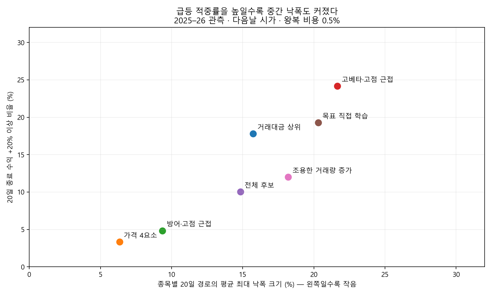

# 다음날 상승·5~20일 +20%·상승 지속을 위한 독립 연구

작성: Codex · 2026-10-03 · 데이터 끝: 2026-10-02. 기존 모델 등록·§11 판정·코드·DB·운영 설정 변경 없음.

## 1. 먼저 답

**세 가지 요구를 함께 충족한다고 검증된 선별법은 이번 연구에서 찾지 못했다.** +20% 사례를 더 많이 포함하는 후보군은 찾았지만, 첫날 상승과 작은 중간 낙폭, 하락장 방어까지 따라오지 않았다. 조건을 낮춰 성공으로 표시하지 않았다.

내 의견은 **급등 후보 찾기 / 상승이 유지되는지 확인하기 / 시장 위험에 따른 보유 비중**을 분리하는 것이다. 종목 하나의 점수에 세 역할을 모두 맡기면 높은 변동성을 실력으로 착각하기 쉽다. 이것은 후속 연구 구조 제안이며 검증된 운용법이 아니다.

현재 자료로는 복잡한 점수보다 먼저 넘어야 할 대조가 **거래대금 상위10**이다. 공격형의 평균 수익 4.40%와 이 단순 대조의 4.33% 차이는 +0.06%p, 날짜 블록 95% 구간은 −3.11~+3.24%p였다. 급등 적중률 개선은 확인되지만 평균 수익 개선은 불확실하다.

## 2. 무엇을 얼마나 시험했나 — 실측

- 원시 패널: 797거래일 × 2,658종목, 2023-06-26~2026-10-02. 연구 평가 중심은 2025~2026.
- 전체 후보 대조 외 **26개 규칙/학습 방식**: 가격·거래량 15개, 직접 학습 4개, 공시·수급·시장 상태 5개, 논문에서 착안한 조용한 거래량 증가 2개. 이 중 수급2개는 짧은 별도 구간으로 평가.
- 각 방식 5/10/20/40/60거래일. 다음날 종가 진입, 20일 재편입 제한, 거래대금 기준 강화, 비용1%, 급격한 시가 갭, 출구 체결 곤란, 상위 기여 종목 제외를 추가 점검.
- 학습형은 월별로 이미 결과가 끝난 과거 표본만 사용. 22개월 × 4방식 = 88개 학습 기록 확인. 정답이 미래까지 걸친 채 학습되는 문제를 피했다.
- 가격 경로 표본400건을 원시 배열에서 별도 계산해 수익·최대 낙폭·첫날·목표 조건 일치 확인. 수익 계산 최대 차이0.
- 저장된 패널은 기존 연구에서 이미 여러 번 본 자료다. **2025~2026도 완전히 미사용인 독립 검증 구간이라고 부르지 않는다.** 반복 실험 전체의 과적합을 없앴다는 뜻이 아니다.

## 3. 목표를 어떻게 쟀나

저녁 목록일을 t라 할 때 **t+1 시가 진입, t+h 종가 평가**다. 왕복 비용0.5%를 단순 차감했다. 기존 스크리너의 t+1 종가·사전등록 규칙을 바꾼 것이 아니다.

| 항목 | 이번 연구 정의 |
| --- | --- |
| 주목표 | 20번째 거래일 종가 기준 비용 후 +20% 이상 |
| 5~20일 안 도달 | 5~20번째 날 중 어느 **종가**라도 비용 후 +20% 이상. 그 가격에 실제 매도했다는 뜻 아님 |
| 첫날 상승 | 다음날 시가 매수 후 그날 종가가 매수가보다 높음 |
| 상승 경로의 대리 조건 | 첫날 상승 + 종료 +20% + 보유 중 최저 종가가 매수가 대비 −10% 이상 + 20일 중 80% 이상 매수가 위 |
| 중간 최대 낙폭 | 종목별 매수가/이후 최고 종가 대비 하락폭의 최악값. 실제 계좌 낙폭 아님 |
| 평균 묶음 수익 | 매 목록일 최대10종목에 각각 1/10씩 배정한 별도 실험의 평균. 매일 10종목을 무한 자금으로 사고 계좌 수익이라고 합산하지 않음 |

−10%, 80%는 사용자가 확정한 허용 손실이 아니라 “우상향”을 임시로 수치화한 연구 조건이다. 주목표 +20%는 그대로 유지했다. 매일 상승만 요구하는 조건은 아니다.

목록에는 당일 기준 가격≥1,000원, 평균 거래대금≥5억원 등 기본 가드를 적용했다. 선택 수가10개 미만이면 남는 몫은 현금. 시가 없음·거래량0·종일 한 가격의 상하한 의심은 미체결 현금 처리. 체결 가능한 종목만의 적중률과 현금 포함 묶음 수익을 구분했다.

## 4. 핵심 결과

20일 평가 목록일은 **2025-01-02~2026-09-02, 406일**이다. 날짜와 종목이 반복되므로 아래 편입 수가 독립 표본 수는 아니다.

| 방식 | 편입 관측 수 | 20일 평균 묶음 수익 [95% 구간] | 종목 +20% 비율 | 첫날 상승 | 경로 조건까지 충족 | 종목 평균 최대 낙폭 |
| --- | --- | --- | --- | --- | --- | --- |
| 전체 후보(대조) | 547100 | +0.12% [-3.00, +2.81] | 10.0% | 42.4% | 4.6% | -14.84% |
| 거래대금 상위10 | 4056 | +4.33% [-0.23, +8.37] | 17.8% | 45.5% | 9.1% | -15.73% |
| 고베타+고점 근접 | 4045 | +4.40% [-1.59, +9.89] | 24.2% | 43.8% | 11.5% | -21.66% |
| 가격 4요소 대조 | 4060 | +1.01% [-1.01, +2.99] | 3.3% | 49.0% | 2.1% | -6.35% |
| 하방 변동 작음+고점 | 4050 | +0.54% [-1.60, +2.75] | 4.8% | 46.2% | 2.6% | -9.35% |
| 경로 포함 학습·트리 | 4048 | +2.65% [-2.12, +6.77] | 19.3% | 43.2% | 8.9% | -20.30% |

공격형(highbeta_high)은 최근60일 시장 민감도가 크고 252일 고점에 가까운 종목을 순위 합으로 고른 단순 연구 규칙이다. 기존 `ld_a`, `le_a`의 재현이나 승격 판정이 아니다. 가격4요소도 기존 운영 모델 그 자체가 아니라 비교용 뼈대다.

| 방식 | 같은 시장 후보 대비 차이(%p) | 차이 95% 구간(%p) | +20% 비율 95% 구간 | 10종목 묶음 자체가 +20%인 비율 |
| --- | --- | --- | --- | --- |
| 거래대금 상위10 | +3.51 | [-0.17, +7.27] | 12.3% ~ 24.3% | 10.8% |
| 고베타+고점 근접 | +4.24 | [-0.32, +8.77] | 17.8% ~ 30.3% | 20.2% |
| 가격 4요소 대조 | +0.15 | [-1.67, +2.03] | 1.4% ~ 6.1% | 0.0% |
| 하방 변동 작음+고점 | -0.14 | [-1.70, +1.62] | 3.0% ~ 7.8% | 1.5% |
| 경로 포함 학습·트리 | +2.53 | [-1.38, +7.05] | 14.5% ~ 23.7% | 10.6% |

신뢰구간은 날짜를20일씩 묶어 2,000회 재추출한 탐색 구간이다. 살아남은 현재 유니버스 편향·자료 오류·이전에 해 본 연구의 선택 편향까지 해결하지 않는다.

공격형은 **5~20일 종가 중 한 번이라도 +20%인 비율37.7%**, 20일 종료에도 +20%인 비율24.2%였다. 이 차이만큼을 익절로 전부 챙길 수 있다고 계산하면 안 된다. 목표 도달일 주문 방식·갭·슬리피지·미체결을 포함한 별도 청산 검증이 필요하다.

“다음날 오른다”를 전날 종가 대비 다음날 종가 상승으로 바꾸어도 공격형47.0%, 거래대금 상위50.5%였다. 시가 매수 후 첫날 이익 비율은 각각43.8%,45.5%이므로, 다음날부터 안정적으로 수익 난다고 말할 근거는 없다.

### 연도에 따라 결과가 달랐다

| 방식 | 2025 평균 수익 [95% 구간] | 2026 평균 수익 [95% 구간] |
| --- | --- | --- |
| 거래대금 상위10 | +5.70% [+1.18, +8.24] | +2.32% [-6.99, +9.88] |
| 고베타+고점 근접 | +7.36% [+0.97, +13.88] | +0.03% [-10.77, +5.87] |
| 상대강도+상승일 비율 | +7.25% [+1.57, +11.57] | -3.77% [-11.60, +1.26] |
| 경로 포함 학습·트리 | +3.17% [-1.47, +7.40] | +1.89% [-8.09, +9.54] |

2025는242일, 2026은164일의 20일 결과다. 공격형의 좋은 평균은 연도에 따라 크게 흔들렸다. 전년의 좋은 성적을 다음 해 성공 확률로 그대로 내보낼 수 없다.

## 5. 하락장에는 덜 하락하고 상승장에는 더 상승했나

비교 날짜가 달라지는 문제를 막기 위해 모든 방식에 **같은 406일**을 썼다. 코스피·코스닥 지수 수익을 반반 합친 고정 대조의 이후20일 수익 부호로 사후 분류했다. 하락117일, 상승289일. 지수는 시가 자료가 없어 목록일 종가→종료일 종가 근사이며, 실제 매수 시점과 완전히 일치하는 투자 가능한 지수 포트폴리오는 아니다.

| 방식 | 하락 구간 수익 | 같은 지수 대비(%p) | 상승 구간 수익 | 같은 지수 대비(%p) |
| --- | --- | --- | --- | --- |
| 거래대금 상위10 | -8.48% | -1.56 | +9.52% | +1.89 |
| 고베타+고점 근접 | -10.50% | -3.59 | +10.43% | +2.80 |
| 가격 4요소 대조 | -1.08% | +5.83 | +1.86% | -5.77 |
| 공격형+시장60일선 | -9.25% | -2.33 | +10.40% | +2.77 |
| 경로 포함 학습·트리 | -9.60% | -2.69 | +7.61% | -0.01 |

하락 구간 지수 평균은−6.91%, 상승 구간은+7.63%다. 공격형은 상승장에서 더 올랐지만 하락장에서 더 떨어졌다. 방어형 대조는 반대였다. **시장60일선 위에서만 공격형을 고르는 단순 필터도 양쪽 목표를 함께 해결하지 못했다.** 미래 하락 여부를 알고 비중을 조정한 결과는 만들지 않았다.

따라서 “장세 필터 하나 붙이면 해결”이라고 권하지 않는다. 종목 선별과 현금 비중의 효과는 별도로 검증해야 한다. 결과표의 방식별 시장 구성에 따른 지수 비교와 위 고정 지수 비교는 다른 질문이므로 혼용하지 않는다.

## 6. 40일·60일로 늘리면 나아졌나

| 방식 | 거래일 | 목록 날짜 수 | 평균 묶음 수익 [95% 구간] | 종목 +20% | 종목 종료 수익 양수 | 종목 평균 최대 낙폭 |
| --- | --- | --- | --- | --- | --- | --- |
| 고베타+고점 근접 | 5 | 421 | +0.59% [-0.82, +1.94] | 8.3% | 47.5% | -9.24% |
| 고베타+고점 근접 | 10 | 416 | +1.81% [-0.92, +4.08] | 15.9% | 47.8% | -14.67% |
| 고베타+고점 근접 | 20 | 406 | +4.40% [-1.59, +9.89] | 24.2% | 48.2% | -21.66% |
| 고베타+고점 근접 | 40 | 386 | +9.86% [-0.81, +22.39] | 30.6% | 50.2% | -30.15% |
| 고베타+고점 근접 | 60 | 366 | +15.17% [+2.89, +34.59] | 37.4% | 53.3% | -35.86% |
| 거래대금 상위10 | 5 | 421 | +0.37% [-0.63, +1.36] | 3.8% | 48.6% | -6.57% |
| 거래대금 상위10 | 10 | 416 | +1.44% [-0.73, +3.36] | 8.9% | 49.4% | -10.57% |
| 거래대금 상위10 | 20 | 406 | +4.33% [-0.23, +8.37] | 17.8% | 53.0% | -15.73% |
| 거래대금 상위10 | 40 | 386 | +9.05% [+1.82, +17.07] | 28.8% | 58.8% | -22.63% |
| 거래대금 상위10 | 60 | 366 | +14.79% [+8.69, +26.43] | 37.6% | 60.8% | -27.25% |
| 가격 4요소 대조 | 5 | 421 | -0.08% [-0.52, +0.38] | 0.1% | 45.5% | -2.26% |
| 가격 4요소 대조 | 10 | 416 | +0.31% [-0.60, +1.23] | 0.8% | 50.3% | -3.86% |
| 가격 4요소 대조 | 20 | 406 | +1.01% [-1.01, +2.99] | 3.3% | 52.1% | -6.35% |
| 가격 4요소 대조 | 40 | 386 | +2.35% [-1.63, +6.17] | 7.5% | 53.7% | -10.20% |
| 가격 4요소 대조 | 60 | 366 | +4.11% [-1.49, +8.97] | 12.2% | 57.2% | -13.17% |

+20% 도달 비율은 늘었지만 중간 낙폭도 커졌다. 공격형은60일 종료 +20%가37.4%였고, 종료 수익 양수는53.3%, 종목 평균 최대 낙폭은−35.9%였다. **오래 기다리면 편안한 우상향으로 바뀐다는 결과는 아니다.**

5/10/20/40/60일의 마지막 평가 목록일은 각각9/23,9/16,9/2,8/4,7/6이다. 긴 보유기간일수록 최근 목록이 빠지므로 표의 수익 차이를 순수한 보유기간 효과로만 해석하지 않는다.

## 7. 좋아 보인 결과를 다시 의심한 결과

| 방식 | 기본 비용0.5% [95% 구간] | 비용1.0% [95% 구간] | 기여 상위5종목 제외 [95% 구간] |
| --- | --- | --- | --- |
| 거래대금 상위10 | +4.33% [-0.23, +8.37] | +3.83% [-0.73, +7.87] | +0.54% [-2.38, +2.79] |
| 고베타+고점 근접 | +4.40% [-1.59, +9.89] | +3.90% [-2.09, +9.40] | +2.25% [-2.59, +6.30] |
| 공격형+시장60일선 | +4.74% [-0.15, +10.10] | +4.31% [-0.61, +9.63] | +2.64% [-1.19, +6.57] |
| 경로 포함 학습·트리 | +2.65% [-2.12, +6.77] | +2.15% [-2.62, +6.27] | +0.39% [-3.20, +3.32] |

상위5종목 제외는 미래 기여도를 보고 지운 민감도 점검이다. 실행 가능한 전략도, 그 종목을 빼라는 권고도 아니다. 거래대금 대조도 소수 주도주의 기여가 컸다. 따라서 대조가 좋았다고 그 방식이 검증됐다는 결론도 아니다.

- 20일 재편입 제한 뒤 공격형은4,045편입 관측→727건, +20% 비율24.2%→21.6%. 하루 평균 새 후보는1.79개였다. 거래대금 대조는4,056→259건, 새 후보0.64개였다. 같은 이름이 매일 나온 효과를 수천 번의 독립 성공으로 세면 안 된다. 빈 자리를 현금으로 둔 이 시험의 평균 수익 하락은 투자 비중 감소도 포함한다.
- 다음날 종가 진입에서 공격형의 +20% 비율24.0%, 거래대금 대조18.5%. 시가 타이밍만 바꿔 목표가 해결되지 않았다. 종가 진입은 매도도 하루 뒤로 밀려 같은 거래가 아니다.
- 평균 거래대금50억원 이상으로 제한해도 공격형 +20% 비율23.8%, 종목 평균 최대 낙폭−21.9%. 유동성 필터만으로 경로 위험이 없어지지 않았다.
- 공격형의20일 출구 거래량0은14건, 종일 하한가 의심1건. 단순 매도 가능성 필터 후 적중률24.1%. 이 근사는 실제 주문 체결 검증이 아니다. 거래정지 종가를 평가액으로 남기는 한계도 있다.
- 목표 직접 학습4개도 충분하지 않았다. +20% 자체를 예측하는 모델은 변동성이 큰 종목을 고를 수 있다. 확률 출력은 별도 보정과 미래 검증 없이 “성공 확률”로 화면에 표시하면 안 된다.

| 방식 | 24개 동시 비교 보정 p(탐색 참고) |
| --- | --- |
| 거래대금 상위10 | 0.283 |
| 고베타+고점 근접 | 0.330 |
| 공격형+시장60일선 | 0.118 |
| 경로 포함 학습·트리 | 0.699 |

위 보정은 수급2개를 빼고 같은 전기간 자료가 있는24개 방식의 초과수익을 함께 비교한 중심화 날짜 블록 max-T 근사다. 이전 연구 전체에 대한 사전등록 검정이 아니며 기존 §11을 대체하지 않는다. 이번 묶음에서도 확정적인 우위로 해석할 결과는 남지 않았다.

## 8. 수급·공시는 도움이 되었나

수급 자료는2026-04-28부터다. 최소1거래일 늦춰 사용했고, 5일 수급이 쌓인 **2026-05-07~09-02의 동일81일**로만 아래 비교를 했다. 원시 `summary_additional.csv`의 수급2025~26 평균에는 자료가 없던 기간의 현금0이 섞여 있으므로 판단에 사용하지 않는다.

| 방식 | 평균 묶음 수익 [95% 구간] | 종목 +20% | 종목 평균 최대 낙폭 |
| --- | --- | --- | --- |
| 거래대금 상위10 | -6.13% [-18.45, +0.61] | 8.6% | -23.82% |
| 공격형+수급 양수 | -7.34% [-20.12, -2.53] | 14.8% | -29.04% |
| 고베타+고점 근접 | -9.42% [-22.39, -3.90] | 14.4% | -31.14% |
| 공격형+수급 순위 | -3.80% [-14.49, +0.87] | 13.2% | -26.02% |
| 전체 후보(대조) | -5.19% [-12.77, +4.20] | 7.7% | -21.14% |

수급 순위를 추가하면 이 구간 공격형 손실은−9.42%→−3.80%로 줄었다. 하지만 목표 적중률은14.4%→13.2%였고, 짧은 표본의 초과수익 구간도0을 포함했다. **방어 보강 가설은 남지만 급등 적중 개선 증거는 없다.**

정정 제목을 뺀 자사주 공시를 하루 늦춰 반영한 방식은 전체기간 평균+0.23%, +20% 비율7.4%. 희석·처분 공시 회피 공격형은+3.95%, 적중23.2%로 기본 공격형을 개선하지 못했다. 공시 종류만 붙이는 접근은 이번 명세에서 우선순위가 낮다. 공시 규모·조건·실제 이행을 포함한 전략 전체가 틀렸다는 뜻은 아니다.

## 9. 논문을 보고 얻은 것과 이번 자료에서 확인한 것

논문이 보여 준 평균 현상과 “이 종목이 내일부터20일 안에20% 오른다”는 예측은 구분해야 한다. 아래는 원저자·학술지·학술기관 자료의 확인 가능한 주장이다. 개별 논문의 모든 표를 재현한 것은 아니다.

| 연구 | 읽은 내용의 요지 | 이번 연구에 준 의미 |
| --- | --- | --- |
| [George·Hwang, 52주 고점](https://onlinelibrary.wiley.com/doi/pdf/10.1111/j.1540-6261.2004.00695.x) | 과거 수익뿐 아니라52주 고점과의 거리가 이후 모멘텀과 관련 | 고점 근접을 후보 생성에 남길 이유. 20일20% 보장은 아님 |
| [Da·Gurun·Warachka, Frog in the Pan](https://ink.library.smu.edu.sg/lkcsb_research/1792/) | 점진적인 정보 반영과 모멘텀 지속의 관계 | 상승일 비율을 시험했으나 이번2026 성적은 약함. 단순 대리식과 논문 자체는 다름 |
| [Gervais·Kaniel·Mingelgrin, 거래량 연구 원고](https://rodneywhitecenter.wharton.upenn.edu/wp-content/uploads/2014/04/9901.pdf) | 비정상적 거래량 뒤 다음 달 상승, 특히 큰 당일 수익이 동반되지 않은 경우 | 급등+거래량 추격과 다른 질문. 조용한 거래량2개를 추가 시험했지만 여기서는 평균−0.99%,−1.25%로 실패 |
| [Lee·Swaminathan, 거래량과 모멘텀](https://onlinelibrary.wiley.com/doi/abs/10.1111/0022-1082.00280) | 거래량은 모멘텀의 크기·지속·반전과 관련 | 큰 거래량을 언제나 좋은 신호로 고정하면 안 됨 |
| [Daniel·Moskowitz, Momentum Crashes](https://www.nber.org/papers/w20439) | 하락·고변동 뒤 반등 국면의 모멘텀 급락 위험 | 논문의 주로 매수·매도 결합 전략과 이번 매수 전용은 다르지만, 국면별 위험을 빼고 평균만 보는 접근 경계 |
| [이경태·이연진, 한국 실적 발표 후 주가표류](https://www.kci.go.kr/kciportal/ci/sereArticleSearch/ciSereArtiView.kci?sereArticleSearchBean.artiId=ART001278944) | 예상 밖 이익과 발표 후60일 주가 반응의 관계를 한국 표본에서 분석 | 다음 방향은 가격식 추가보다 당시 알려진 실적 충격. 현재 시점 재무를 과거에 소급하면 안 됨 |
| [Bailey 외, 백테스트 과적합](https://escholarship.org/uc/item/4w1110bb) | 여러 전략을 과거에서 고를 때 발생하는 선택 문제 | 이번 탐색의 최고 성적을 바로 운용 우승자로 정하지 않음 |

**후속 연구 우선순위에 대한 내 의견:** “가격이 강한가”에 더해 “새로 알려진 정보가 이익 전망을 바꿨는가”를 확인하는 쪽이다. 이 주장이 이번 데이터에서 입증된 것은 아니다. 현재 DB에는 당시 예상치·발표시각·최초 발표값을 갖춘 실적 서프라이즈 자료가 없어서 정직한 검증을 할 수 없었다. 그래서 현재 재무 수치를 과거에 붙여 좋은 결과를 만들지 않았다.

## 10. 내가 제안하는 구조 — 아직 검증 전인 연구 설계

### A. 매일 억지로10개를 내지 않는 사건 중심 후보

“언제나 가장 높은 점수10개”에서 **새로운 촉매가 확인된 날의 소수 후보**로 바꾸는 가설이다. 후보 없음도 정상 출력으로 둔다. 촉매는 최초 실적 발표와 당시 기대치 차이, 가이던스 변화처럼 실제 발생시점이 복원되는 자료부터 검토한다. 뉴스의 긍정 문구 수나 현재 재무 수치로 대체하지 않는다.

기대 이득: 평소 변동성만 큰 종목과 새로운 정보 때문에 재평가될 가능성이 있는 종목을 구분할 여지. 검증: 최초 발표 시각 이후 실제 가능한 다음 진입, 같은 날짜·시장·유동성·변동성의 대조, 종료+20%·경로 위험을 기존과 동일하게 평가. 과거 공시를 오늘 수정된 값으로 다시 쓰지 않는다.

### B. 후보 생성과 매수 시점을 따로 평가

고점 근접·상대강도·거래대금은 “살펴볼 종목”을 고르는 역할로만 남긴다. 다음날 실제 수요가 유지되는지 보는 진입 조건은 별도 가설이다. 다음날 시가 갭과 초반 거래대금, 돌파 유지 여부 등을 쓸 수 있지만, 분봉·실시간 수집시각·체결 자료가 없으므로 이번 일봉에서 검증했다고 말할 수 없다.

조건을 기다려 매수한다면 수익은 **그 실제 진입가부터** 다시 계산해야 한다. 전날 목록 가격부터 이미 오른 부분을 내 수익으로 세지 않는다. “진입을 늦춘 뒤 적중률 증가”와 “기회를 놓친 비용”도 함께 본다.

### C. 종목 수익 목표와 계좌 방어를 분리

상승장 초과상승·하락장 방어를 모든 개별 종목에 요구하기보다, 종목 후보의 기대와 계좌 노출을 다른 시험으로 나눈다. 현금 비중·동일 업종 집중 제한 등은 위험을 조절하는 가설이지, 미래 장세를 맞혔다는 증거가 아니다. 이번60일선 필터가 충분하지 않았으므로 그대로 적용하자는 권고는 아니다.

계좌 시험에는 한정된 자금, 겹치는20일 보유, 기존 보유의 추가매수, 거래비용, 체결 불가, 청산 순서를 명시해야 한다. 종목별 평균 결과를 계좌 수익률로 환산하거나20으로 나눠 “하루 버는 돈”으로 표시하지 않는다.

### D. 화면은 승자 순위보다 근거와 실패를 보여준다

후보마다 최소한 `새로 나온 이유 · 지금부터 잰 +20% 사례 비율 · 중간 하락 범위 · 자료 충분성`을 분리한다. 모든 후보를 한 점수로 섞지 않는다. 아직 보정하지 않은 학습 출력은 확률로 표시하지 않는다. 신규 후보와 기존 관찰 유지도 구분해 반복 목록이 새 기회처럼 보이지 않게 한다.

## 11. 지금 중단할 것과 남길 것

| 판단 | 내용 |
| --- | --- |
| 현재 근거로 채택하지 않음 | 급등+거래량·가속·단순 돌파의 더 많은 임계값 탐색, 학습모델 복잡화로 바로 해결 기대,60일선 하나로 양면 방어 해결 주장 |
| 대조로 반드시 유지 | 거래대금 상위10, 전체 후보, 방어형 가격 대조. 복잡한 후보가 이들을 왜 넘어야 하는지 명확히 하기 |
| 관측 가설로 유지 | 고점 근접 공격형의 높은 목표 적중률, 짧은 구간 수급 보강의 손실 완화. 검증된 추천 목록은 아님 |
| 다음 데이터가 있어야 진행 가능 | 최초 실적 발표·당시 예상치·발표시각, 당시 상장/상폐 전체 유니버스, 진입 조건 검증용 분봉과 체결 자료 |
| 미래 검증이 필요한 부분 | 지금 고른 소수 사양을 동결한 뒤 아직 보지 않은 기간. 동일 패널의 추가 순위 경쟁으로 대신할 수 없음 |

사용자가 정해야 할 연구 선택은 이후에 모아 둘 수 있다: 허용 가능한 중간 하락폭, 실제 보유 종목 수·자금 제약, +20%에 닿으면 청산할지 계속 보유할지. 이번에는 이 답을 임의로 유리하게 정해 목표 달성으로 판정하지 않았다.

## 12. 한계와 재현 자료

현재 패널은 당시 모든 상장폐지 종목을 포함한 완전한 시점별 유니버스가 아니다. 가격 조정·상장주식수 역사·종목 구성의 편향이 남는다. 거래량이 있는 날의 OHLC 불일치112행도 확인됐다. 대부분 작은 차이지만 일부 오류가 있어 원천 검증 없이 실제 주문 수준 정확도를 주장하지 않는다. 큰 수익은 임의 상한으로 잘라 결과를 좋게 만들지 않았다.

20일 관측406개는 보유 창이 크게 겹친다. 20일 블록 구간도 완전한 독립성 보장이 아니다. 수급은81일뿐이다. 비용0.5%/1%는 연구 가정이며 종목별 호가·세금·시장충격을 정밀 반영한 비용이 아니다. 장중 목표 도달이나 손절 체결은 이번 결과에 포함하지 않았다. [KRX 가격제한폭 안내](https://global.krx.co.kr/contents/GLB/06/0602/0602020202/GLB0602020202T2.jsp)와 달리 본 코드의29.5%·종일 단일가격 검사는 거래소 체결 판정을 대체하는 정확한 상하한 계산이 아니다.

패널 SHA256: `3215753506c0500e2895695cff5cd740609cf00f2556a71e4a61f58226c55e79`.

| 자료 | 위치 |
| --- | --- |
| 계산 전 사양·후속 탐색 구분 | `research/target20_20261003/PLAN.md`, `EXTENSIONS.md`, `FINAL_DIAGNOSTICS.md` |
| 기본·확장·독립 경로 진단·공통 장세 비교 코드 | `research/handoff/code_target20_20261003.py`, `code_target20_extensions.py`, `code_target20_diagnostics.py`, `code_target20_regimes.py` |
| 전체 수익·적중·경로·구간 | `summary.csv`, `summary_additional.csv`, `summary_quiet.csv`, `rate_intervals.csv` |
| 수급의 올바른 공통기간 비교 | `summary_flow_common.csv` |
| 반증·연도·짝비교·동시비교 | `stress.csv`, `paired_differences.csv`, `common_regimes.csv`, `multiple_comparison_fullwindow.csv` |
| 학습 시점·확률 구간 점검 | `ml_training_audit.csv`, `ml_calibration.csv`, `verification.json` |
| 재현용 최신 목록 | `latest_research_candidates.csv`, `latest_additional_candidates.csv` — 10/2 연구점수 출력일 뿐, 목표 충족이 검증된 매수 목록 아님 |

표에서 짧게 쓴 파일은 모두 `research/target20_20261003/` 아래다. 재실행은 저장소 루트에서 위 계산 스크립트를 기본→확장→진단→장세 순서로 실행한다. 수집기·배치를 호출하지 않는다. DB는 읽기 전용 연결만 한다. 연구용 스크립트의 필요 라이브러리는 numpy/pandas/scikit-learn/threadpoolctl/pyarrow/matplotlib이다.

## 부록: 실패를 포함한 전체 전기간 결과

수급2개를 제외한24개 방식과 전체 후보 대조. 같은406개 목록일,20일,비용0.5%. 이 표는 순위 확정표가 아니다.

| 방식 | 편입 관측 수 | 평균 묶음 수익 [95% 구간] | 종목 +20% | 경로 조건 포함 | 종목 평균 최대 낙폭 |
| --- | --- | --- | --- | --- | --- |
| 상대강도 가속+거래대금 | 3997 | -4.86% [-9.39, -0.41] | 14.2% | 6.5% | -26.78% |
| 20일 돌파+거래대금 | 3992 | -2.78% [-7.31, +1.56] | 16.9% | 8.1% | -25.89% |
| 수축 후 돌파 | 3661 | +1.60% [-0.83, +4.42] | 16.3% | 6.9% | -17.38% |
| 거래대금 상위10 | 4056 | +4.33% [-0.23, +8.37] | 17.8% | 9.1% | -15.73% |
| 고변동성 상위10 | 4003 | -7.13% [-12.15, -2.72] | 13.2% | 4.9% | -28.22% |
| 가격 4요소 대조 | 4060 | +1.01% [-1.01, +2.99] | 3.3% | 2.1% | -6.35% |
| 하방 변동 작음+고점 | 4050 | +0.54% [-1.60, +2.75] | 4.8% | 2.6% | -9.35% |
| 갭 상승 지속 | 3819 | -2.35% [-6.30, +1.13] | 15.0% | 6.4% | -22.48% |
| 고베타+고점 근접 | 4045 | +4.40% [-1.59, +9.89] | 24.2% | 11.5% | -21.66% |
| 과매도 후 회복 | 2545 | -2.09% [-4.72, +0.03] | 10.0% | 4.2% | -18.88% |
| 상대강도+고점 근접 | 3962 | +0.15% [-4.33, +4.73] | 21.0% | 9.9% | -25.31% |
| 수익/변동성 | 4003 | -0.34% [-4.90, +4.88] | 18.3% | 8.7% | -24.54% |
| 상대강도+상승일 비율 | 4041 | +2.80% [-2.34, +7.58] | 20.8% | 10.8% | -22.80% |
| 강한 상승+거래량 | 3452 | +1.69% [-0.82, +4.34] | 15.5% | 8.0% | -16.60% |
| 상승 추세 눌림 | 3982 | -2.45% [-6.10, +0.63] | 13.3% | 6.0% | -20.85% |
| 전체 후보(대조) | 547100 | +0.12% [-3.00, +2.81] | 10.0% | 4.6% | -14.84% |
| 자사주 공시 후 상대강도 | 3054 | +0.23% [-1.37, +1.78] | 7.4% | 3.4% | -11.93% |
| 공격형+시장60일선 | 3451 | +4.74% [-0.15, +10.10] | 24.6% | 11.7% | -20.53% |
| 공격형+희석 공시 회피 | 4044 | +3.95% [-1.93, +9.33] | 23.2% | 10.8% | -21.62% |
| 20% 직접 학습·트리 | 4036 | +1.73% [-3.74, +6.70] | 19.4% | 9.5% | -21.36% |
| 20% 직접 학습·로지스틱 | 4029 | -1.26% [-6.78, +4.33] | 19.1% | 8.7% | -25.22% |
| 경로 포함 학습·트리 | 4048 | +2.65% [-2.12, +6.77] | 19.3% | 8.9% | -20.30% |
| 경로 포함 학습·로지스틱 | 4029 | -0.80% [-6.12, +4.67] | 20.0% | 9.6% | -25.16% |
| 조용한 거래량 증가 | 3972 | -0.99% [-3.97, +1.67] | 9.4% | 4.4% | -15.85% |
| 조용한 거래량+상대강도 | 3966 | -1.25% [-4.34, +1.94] | 12.0% | 5.6% | -18.19% |

## 도전 카드 2개

1. **실적 촉매 × 가격 수요 확인:** 기대 이득은 단순 고변동성 선택과 정보 재평가를 구분하는 것. 검증 경로는 최초 발표시각/당시 예상치 확보→단일 사양 고정→거래대금 대조와 미래 동일기간 비교. 현재 입증되지 않았다.
2. **매일 목록 대신 신규 기회 기록:** 기대 이득은 반복 편입과 실제 신규 기회를 구분하고 자금 중복 계산을 막는 것. 검증 경로는 기존 신호·목표를 바꾸지 않고 신규 진입부터 완결 청산까지 고정 자금으로 재평가. 성공률만 올리고 기회 수가 사라지는지도 함께 보고한다.
