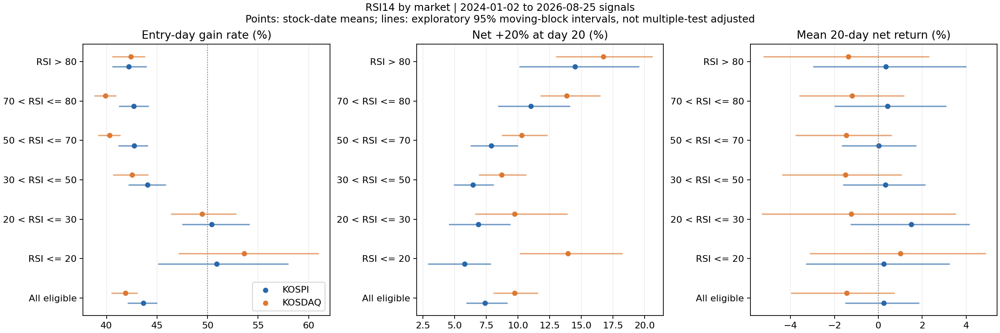

# 시장·재무·RSI·수급·모델 점수 전체 조건 탐색

작성: 2026-10-04 / Codex 독립 계산. 운영 코드·DB·기존 판정 기준은 변경하지 않았다.

## 1. 답부터

**KOSPI와 KOSDAQ을 나누고 조건을 세분화하는 것은 도움이 됐다. 다만 이번 결과로 ‘다음 날부터 상승하면서 5~20일 안에 20%를 벌고, 하락에도 강한 종목 목록’을 검증했다고 말할 수는 없다.**

직접 계산한 주요 결과는 다음과 같다.

- KOSDAQ의 RSI14 20 이하 구간은 첫날 상승 비율 53.61%, 20일 평균 수익 +1.00%, 20일 끝에 순수익 20% 이상인 비율 13.94%였다. 첫날 상승 비율의 95% 구간은 47.10~60.99%로, 50%를 확실히 넘었다고 말하기 어렵다.
- RSI가 매우 높은 구간은 20% 수익에 도달하는 비율이 높아져도 평균 수익이나 보유 중 손실이 함께 좋아지지 않았다. **급등 가능성과 편안한 우상향은 서로 다른 목표였다.**
- KOSPI의 시가총액 상위 20%는 전체 분석 기간 평균 수익 +1.94%, 같은 날 비교 종목 평균보다 +1.70%p였다. KOSDAQ에서는 같은 조건의 평균 수익이 −0.69%였다. 크기가 크다는 조건을 두 시장에 동일하게 적용할 근거는 약하다.
- 저PER 근사값은 상대적으로 작은 손실과 연결됐지만 20% 수익 비율은 낮았다. 수급도 ‘외국인·기관이 많이 사면 좋다’는 일관된 관계를 보여주지 않았다.
- 과거에 좋았던 조합도 새 구간에서 크게 무너졌다. KOSDAQ에서 2024~2025년의 선별 조건을 통과한 6,789개 조합 중 2026년 평균 수익이 양수였던 것은 487개였다.

마지막 숫자는 모든 가능한 전략의 성공률이 아니다. 서로 비슷한 조합이 많이 포함된 **이번 탐색 격자의 결과**다. 서로 독립적인 6,789번의 실험으로 해석하면 안 된다.

## 2. 얼마나 넓게 봤나

| 항목 | 계산 범위 |
|---|---:|
| 원재료 지표 | 149개 |
| 단일 조건 | 803개 |
| 서로 다른 지표의 두 조건 조합 | 320,095개 |
| 시장을 나눈 조건·조합 수 | **641,796개** |
| 전체·2024·2025·2026별 결과 행 | **2,567,184행** |
| 분석 종목×목록 날짜 | 854,276건 |
| 목록 기준일 | 2024-01-02~2026-08-25, 644일 |
| 별도 모델 자체 종목군 분석 | 25개 모델 × 2시장 × 20조건 = 1,000행 |

연속 지표는 양 끝만 고르지 않고 **5개 분위 구간 모두**를 계산했다. 두 지표의 조합도 5×5 구간 전체를 계산했다. RSI·PER·ROE 등은 읽기 쉬운 절대 구간도 추가했다. 표본이 없거나 짧은 결과, 좋지 않은 결과도 원자료에 남겼다.

‘최대한’이라는 요청에 맞춰 정한 격자 안의 전수 계산을 완료했다. 임의의 모든 숫자 경계, 3개 이상 조건의 모든 교차, 모든 보유일·매매 규칙까지 전수 계산한 것은 아니다. 조합 수가 커지는 것만으로 발견의 신뢰도가 높아지지도 않는다.

| 지표군 | 개수 | 결과가 있는 목록 날짜 수 | 내용 |
|---|---:|---:|---|
| 가격·거래량·기술 지표 | 59 | 519~644 | RSI6/14/28, 수익률, 이동평균, 변동성, 추세, 거래대금, 거래량, 가격 충격 등 |
| 규모·가격 | 2 | 644 | 시가총액 근사, 주가 |
| 시장 상태 | 8 | 520~644 | 지수 추세·변동 등. 분위 계산에는 과거 자료가 추가로 필요 |
| 공시 시점 반영 연간 재무 | 10 | 644 | PER/PBR 근사, ROE, 이익·영업이익·현금흐름 수익률, 부채, 영업이익 증가 등 |
| 수급 | 19 | 51~75 | 외국인·기관·개인·연기금·투신·증권·사모·보험·은행, 5/20일 |
| 공매도·신용 | 6 | 77~379 | 비율·잔고·변화. 일부 긴 기간도 결측이 많음 |
| 실제 일별 가치평가 | 5 | 32 | PER/PBR/EPS/BPS/배당 |
| 애널리스트 | 3 | 4 | 짧은 기록도 계산에는 포함, 판단 근거로는 부족 |
| 기록된 모델 점수 | 25 | 0~39 | v3 7개, lowvol 11개, wu 7개 |
| 기존 스냅샷 지표 | 12 | 51~59 | 당시 저장된 값. 사후 수정 가능성은 별도 한계 |

날짜 수는 모든 종목에 매일 값이 있다는 뜻이 아니다. 정확한 지표별 시작·끝·건수는 `feature_inventory.csv`에 기록했다.

## 3. 계산의 뜻 — 기존 성적표와 혼동하지 않기

1. 목록 날짜 다음 거래일 **시가**에 진입하고 20번째 거래일 **종가**에 평가했다. 비용은 왕복 합계 0.5%p를 차감했다. 기존 40일 성적표의 다음 날 종가 진입·다른 비용 기준과 숫자를 직접 비교하면 안 된다.
2. 아래 ‘평균 수익’은 조건에 해당하는 **종목×날짜 수익의 평균**이다. 상위 10개 계좌, 일별 자본 배분, 복리 계좌 수익이 아니다.
3. ‘첫날 상승’은 다음 날 시가보다 당일 종가가 높은 경우다. 전날 종가 대비 상승이나 시가 매수 직후부터 계속 상승했다는 뜻은 아니다.
4. ‘20% 비율’은 **20일 끝의 비용 후 수익이 20% 이상**인 비율이다. 5~20일 사이 어느 종가에서든 20%를 넘은 `touch`도 별도로 저장했다. 장중 고가에서 정확하게 팔았다는 가정은 하지 않았다.
5. ‘보유 중 최저 수익’은 진입가 대비 보유 중 최저 종가 수익이다. 직전 고점 대비 최대 하락인 `mdd`와 다르며 둘 다 계산했다.
6. ‘비교 종목 대비’는 같은 날·같은 시장·해당 지표가 관측된 분석 종목군의 평균 대비다. **KOSPI/KOSDAQ 지수 대비 수익이 아니다.** 지수 추세 조건을 넣었다고 해서 지수 대비 방어력을 검증한 것은 아니다.
7. 원래 연구의 공통 조건인 주가 1,000원 이상, 20일 평균 거래대금 5억원 이상, 충분한 과거 가격 등은 유지했다. 무거래·비정상 가격과 매수 불가능이 의심되는 단일 가격 상·하한가를 제외했다. 따라서 전체 상장주식 무제한 분석은 아니다.
8. ‘동시에 만족’ 지표는 20일 순수익 20% 이상, 첫날 상승, 진입가 대비 최저 종가 −10% 이상, 보유 종가의 80% 이상이 진입가 위인 조건이다. 사용자의 우상향 희망을 연구용으로 수치화했으며, 승인된 새 채택 잣대가 아니다.

## 4. 시장을 나누면 무엇이 달라졌나

단위: 수익 %, 비율 %. 비용 차감 후. 같은 종목이 여러 날짜에 반복 포함된다.

| 시장·조건 | 종목×날짜 | 날짜 수 | 20일 평균 수익 | 20% 비율 | 첫날 상승 | 보유 중 최저 수익 평균 |
|---|---:|---:|---:|---:|---:|---:|
| KOSPI 공통 분석군 | 341,619 | 644 | +0.24 | 7.39 | 43.64 | −7.81 |
| KOSPI 시총 상위 20% | 68,604 | 644 | +1.94 | 9.45 | 44.79 | −7.35 |
| KOSDAQ 공통 분석군 | 512,657 | 644 | −1.45 | 9.72 | 41.86 | −11.28 |
| KOSDAQ 시총 상위 20% | 102,782 | 644 | −0.69 | 12.43 | 41.95 | −12.12 |

KOSPI 시총 상위의 비교 종목 대비 차이는 +1.70%p, 탐색용 95% 구간은 +0.76~+2.86%p였다. 그러나 절대 평균 수익의 구간은 −0.15~+4.18%로 0을 포함한다. KOSDAQ의 상대 차이는 +0.75%p, 구간 −0.12~+1.76%p였다.

**해석:** KOSPI의 규모 조건은 추가 점검 가치가 있지만, 두 시장 모두에 ‘큰 주식이면 방어적’이라고 결론 내릴 수 없다. 또한 시총은 패널의 주식 수로 만든 근사값이므로 과거 증자·주식 수 변화의 완전한 반영은 보장하지 못한다.

## 5. RSI: 반등과 추세를 구분할 필요

| 시장·RSI14 | 날짜 수 | 20일 평균 수익 | 20% 비율 | 첫날 상승 | 보유 중 최저 수익 평균 |
|---|---:|---:|---:|---:|---:|
| KOSPI ≤20 | 336 | +0.25 | 5.76 | 50.91 | −7.63 |
| KOSPI 20~30 | 615 | +1.51 | 6.86 | 50.40 | −7.01 |
| KOSPI >80 | 596 | +0.35 | 14.50 | 42.22 | −12.29 |
| KOSDAQ ≤20 | 438 | +1.00 | 13.94 | 53.61 | −10.50 |
| KOSDAQ 20~30 | 630 | −1.23 | 9.73 | 49.45 | −11.60 |
| KOSDAQ >80 | 633 | −1.37 | 16.76 | 42.41 | −15.93 |

구간 표기 20~30은 20 초과·30 이하를 뜻한다. 나머지 구간도 모두 계산했으며 `all_single_results.csv`와 그림에서 볼 수 있다.

KOSDAQ RSI≤20의 비교 종목 대비 차이는 +2.65%p, 95% 구간 +0.15~+5.06%p였다. 하지만 절대 평균 수익의 구간은 −3.14~+4.90%였고, 첫날 상승 비율의 구간도 50%를 포함했다. 수십만 조건을 본 뒤 고른 결과라는 점까지 고려하면, 이를 매수 신호로 확정할 근거는 부족하다.

보유 기간을 늘려도 자동으로 우상향이 되지는 않았다.

| KOSDAQ RSI≤20 보유일 | 평균 수익 | 수익 양수 비율 | 순수익 20% 이상 비율 |
|---|---:|---:|---:|
| 5일 | +1.71 | 52.22 | 5.53 |
| 10일 | +1.81 | 48.98 | 10.58 |
| 20일 | +1.00 | 별도 원자료 | 13.94 |
| 40일 | +2.55 | 47.72 | 20.79 |
| 60일 | +0.70 | 42.92 | 20.88 |

60일은 아직 결과가 없는 최근 표본을 제외해 표본이 조금 다르다. 40·60일 비교 종목 대비 차이의 구간도 0을 포함했다. **해석:** 극단 과매도는 단기 반등 가설로 다루는 편이 맞으며, 장기 우상향 가설과 합치지 않는 것이 좋다.



## 6. PER·재무: ‘싸다’의 정의부터 분리

실제 일별 PER 기록으로 20일 결과를 볼 수 있는 날짜는 32일뿐이다. 따라서 긴 기간은 공시가 알려진 시점 이후의 연간 순이익과 시가총액 근사로 만든 `annual_pe_approx`를 사용했다. **당시의 실제 12개월 누적 PER과 같지 않다.**

| 연간 PER 근사 0 초과·5 이하 | 날짜 수 | 평균 수익 | 20% 비율 | 첫날 상승 | 보유 중 최저 수익 평균 |
|---|---:|---:|---:|---:|---:|
| KOSPI | 644 | +0.92 | 5.62 | 44.41 | −6.13 |
| KOSDAQ | 644 | −0.76 | 5.22 | 43.77 | −8.10 |

두 시장 모두 전체 분석군보다 20% 비율이 낮았다. 비교 종목 대비 수익 차이의 구간은 모두 0을 포함했다. 낮은 PER을 급등 후보의 필수 조건으로 쓰면 오히려 목표 종목을 놓칠 수 있다.

공시는 행 접수일과 항목별 접수일 중 늦은 날짜 **다음부터** 사용했다. 너무 오래된 연간 값은 제외했다. 적자·0 이하 PER은 양수 PER의 하위 분위에 섞지 않고 별도 구간으로 뒀다. 순이익·영업이익 증가가 높다는 것을 시장 예상치 대비 ‘실적 서프라이즈’라고 부르지 않았다.

최근 Claude 연구에는 추가 연간 재무와 실적 증가 분석이 있다. 따라서 ‘실적 자료가 전혀 없다’고 하는 것은 현재 상태와 맞지 않는다. 다만 **시장 예상치, 최초 공시 원문 시점, 분기 실적 서프라이즈를 모두 검증했다는 뜻은 아니다.** 이번 독립 계산과 Claude 연구의 수치를 섞지 않았다.

## 7. 수급: 많이 산 주식이 항상 좋지는 않았다

5일 순수급을 20일 평균 거래대금으로 나눠 시장 안에서 구분했다. 정보 지연을 줄이기 위해 하루 늦춘 값을 사용했고, 중간 날짜가 빠진 합계는 쓰지 않았다. 아래는 기록이 있는 75일의 결과다.

| 시장·5일 수급 구간 | 평균 수익 | 20% 비율 | 비교 종목 대비 차이 |
|---|---:|---:|---:|
| KOSPI 외국인 하위 20% | −1.73 | 6.74 | +1.46%p |
| KOSPI 외국인 상위 20% | −3.23 | 4.73 | −0.04%p |
| KOSPI 기관 하위 20% | −2.89 | 5.34 | +0.30%p |
| KOSPI 기관 상위 20% | −1.84 | 7.19 | +1.34%p |
| KOSDAQ 외국인 하위 20% | −6.73 | 9.09 | +0.51%p |
| KOSDAQ 외국인 상위 20% | −6.72 | 10.22 | +0.51%p |
| KOSDAQ 기관 하위 20% | −7.00 | 10.04 | +0.24%p |
| KOSDAQ 기관 상위 20% | −7.59 | 8.63 | −0.36%p |

KOSPI 기관 상위의 상대 차이는 좋아 보여도 절대 수익은 음수였다. KOSDAQ 외국인 양 끝은 거의 같은 평균 수익이었다. 이 결과로 기관 매수를 추종하거나 외국인 매도를 역으로 사라는 결론을 내리지 않는다. 짧은 기간의 시장 상태와 수급에 앞선 가격 움직임을 분리해야 한다.

공매도·신용·애널리스트 지표도 조합 계산에서 빼지 않았다. 다만 애널리스트는 결과 날짜가 4일뿐이다. 수급 등도 원자료의 정확한 공개 시각과 사후 수정 여부까지 확인한 것은 아니므로, 하루 지연만으로 완전한 당시 정보라고 보증할 수 없다.

## 8. 모델 점수: 같은 모델 안에서 먼저 비교

모델마다 원래 고르는 종목군이 다르다. 공통 거래대금·주가 조건을 적용하면 소형주 모델의 원래 종목이 많이 사라질 수 있어, **각 모델의 원래 기록 집합 안에서 점수·RSI·PER·거래대금을 나눠 보는 계산**을 추가했다. 이때도 정상 가격과 진입 가능성 검사는 유지했다.

점수의 저장 시각이 예정 매수일 오전 9시보다 늦으면 제외했다. 예를 들어 6월 초 목록에 6월 말 저장된 점수를 넣으면 당시 매매 가능한 성과처럼 보이는 오류가 생긴다. 제외 내역은 `model_timing_audit.csv`에 있다.

아래는 각 모델 자체 종목군에서 점수 상위 20%의 예다. 서로 다른 종목군·기간이므로 모델 순위표가 아니다.

| 모델 | 시장 | 날짜 수 | 평균 수익 | 20% 비율 | 해당 모델 비교군 대비 |
|---|---|---:|---:|---:|---:|
| le_a | KOSPI | 25 | +5.99 | 15.98 | +1.37%p |
| le_a | KOSDAQ | 25 | +6.79 | 24.76 | +0.96%p |
| lv_b | KOSPI | 31 | +4.92 | 6.77 | −0.17%p |
| lv_b | KOSDAQ | 31 | +3.64 | 9.70 | −0.36%p |
| v30 | KOSPI | 39 | +3.43 | 8.90 | −0.39%p |
| v30 | KOSDAQ | 39 | +4.49 | 12.85 | −0.14%p |

20일 보유 창이 겹치는데 관측 날짜는 25~39일뿐이다. 이런 표본에서 나온 좁은 재표집 구간은 안정성을 보장하지 않는다. 기존 §11 판정이나 채택·은퇴 판단으로 대체하지 않는다. 대형 가치·주도주 트랙을 이 25개 모델 점수 비교에 모두 포함했다고 주장하지 않는다.

## 9. 좋아 보이는 조합을 의심해 본 결과

각 시장에서 2024년과 2025년 **각각** 종목×날짜 200건 이상, 날짜 40일 이상이고, 비교 종목 대비 평균 수익과 ‘동시에 만족’ 비율 차이가 모두 양수인 조합을 별도로 추렸다. 이는 대표 사례를 고르는 연구 기준이며, 원자료에서 다른 조합을 삭제하는 기준이 아니다.

| 시장 | 과거 두 해 조건 통과 | 2026 결과 있음 | 2026에서도 두 상대 차이 양수 | 2026 절대 평균 수익 양수 |
|---|---:|---:|---:|---:|
| KOSPI | 9,727 | 9,669 | 6,286 | 5,671 |
| KOSDAQ | 6,789 | 6,789 | 4,273 | **487** |

특히 KOSDAQ은 상대 성과가 양수인 조합이 많아도 절대 수익은 대부분 음수였다. 사용자의 목표는 ‘20% 이상 벌기’이므로 상대 차이만으로 후보를 추천하면 목표가 바뀐다.

**실패 사례:** 과거 두 해의 ‘동시에 만족’ 상대 차이 평균으로 정렬한 KOSDAQ 첫 조합은 연간 PER 근사 4분위와 RSI14>80이었다. 2026년에는 272건·95일에서 평균 수익 **−9.29%**, 비교군 대비 **−8.03%p**였다. 상대 차이의 탐색용 구간도 −12.56~−5.01%p였다.

반대로 낮은 가격 충격 지표(`amihud60` 하위 20%)와 RSI14>80 조합은 2026년 평균 +4.64%, 20% 비율 27.86%였다. 그러나 비교군 대비 +7.44%p의 구간은 **−4.02~+12.76%p**로 넓었다. 같은 방식으로 고른 좋은 사례만 남기면 안정된 규칙처럼 보이기 쉽다.

두 조건의 조합은 전체 비교군보다 좋은지만 보지 않았다. **A만 쓸 때보다 B를 더 붙여 좋아졌는지, B만 쓸 때보다 A가 도움이 됐는지**도 계산했다. 원자료의 `added_b_ret`는 A에 B를 더한 차이, `added_a_ret`는 B에 A를 더한 차이다. 짧은 수급 기록을 붙여 기간만 바뀐 효과를 줄이기 위해 두 지표가 모두 관측된 같은 날짜·종목군에서 비교했다.

2026년 자료는 앞선 연구에서 이미 확인한 자료다. 이번 연도 분할은 시간에 따른 유지 여부 점검이며 **아무도 보지 않은 최종 시험 표본은 아니다.**

## 10. 통계와 데이터 한계

- 반복되는 종목과 겹치는 보유 기간 때문에 85만 건을 85만 독립 관측으로 취급하지 않았다. 전체 탐색은 최대 20일 단위의 34개 날짜 묶음으로 2,000회 재표집했다. 상세 사례에는 연속 20일 묶음 재표집을 별도로 적용했다.
- 전체 탐색의 `maxT_p`는 시장×기간×단일/조합 그룹 안에서 여러 검사를 고려한 **근사 진단값**이다. 641,796개 전체를 통합 보정한 확정 확률이 아니다. 상세 표·그림의 95% 구간도 전체 탐색 횟수에 대한 보정을 하지 않았다.
- 이 원자료의 기간·종목 구성으로 모든 상장폐지·과거 편입 및 제외 이력까지 복원했다고 보증하지 못한다. 현재 남아 있는 종목 중심의 자료라면 결과가 낙관적일 수 있다.
- 거래정지 등의 매도가격이 없는 경우 전일 종가를 이어 쓴 값이 포함된다. 그 가격에 실제 팔 수 있다는 뜻이 아니다. 체결 충격·수량·현금 제한도 이번 종목별 분석에는 포함하지 않았다.
- 일별 평균 계좌 수익, 지수 대비 실제 계좌 방어력, 장중 손실, 거래 가능한 오늘의 매수 목록은 이번 계산의 산출물이 아니다. 기존 계좌 실험과 분리해야 한다.
- 연간 공시 시점 검사를 했지만 역사적 주식 수, 원본의 정정·사후 수집, 모든 정보의 최초 공개 시각까지 완전히 재구축하지는 못했다.

많은 지표를 탐색할수록 우연히 좋아 보이는 조합이 늘어난다는 점은 [Harvey·Liu·Zhu의 연구](https://www.nber.org/papers/w20592)와도 맞닿아 있다. 이 논문을 근거로 기존 사전등록 문턱을 변경하지 않았다.

## 11. 다음 연구에서 더 나은 방향 — 검증된 전략이 아닌 의견

1. **목표를 세 개로 나누어 평가한다.** 20% 급등 가능성, 다음 날 반등 가능성, 40~60일 동안 덜 흔들리는 상승을 한 숫자로 합치면 중요한 차이가 사라진다. 조건별로 세 결과를 나란히 비교하는 편이 낫다.
2. **시장별 가설을 따로 둔다.** KOSDAQ 극단 과매도는 단기 반등, KOSPI 규모·유동성은 상대적인 안정성 가설로 분리해 후속 자료에서 확인할 가치가 있다. 지금부터 매매에 적용하자는 제안은 아니다.
3. **재무는 위험·기업 상태, 가격과 수급은 시점이라는 가설을 시험한다.** 저PER을 급등의 필수 조건으로 삼기보다, 같은 가격 신호에서 적자·재무 상태가 손실 꼬리를 줄이는지를 비교할 수 있다. 이번 전수 조합의 부모 조건 대비 차이가 출발점이다.
4. **새 조건 수보다 새 정보의 시간을 늘린다.** 실제 PER 32일, 수급 51~75일, 모델 0~39일에서는 조합을 더 늘려도 독립된 정보가 크게 늘지 않는다. 예상 실적 대비 차이, 최초 공개 시각, 당시 업종·주식 수·상장폐지 이력이 다음에 필요한 자료다.
5. **하락장 방어는 별도 계좌 질문으로 남긴다.** 신호가 없으면 현금을 보유하는 경우와 매일 반드시 종목을 고르는 경우는 다르다. 사용자의 지수 대비 방어 목표는 현금·동시 보유·체결을 포함한 계좌 기준으로 후속 확인해야 한다. 이번 조건 평균으로 대신 판정하지 않는다.

## 12. 재현·산출물

직접 확인한 검산:

- 무작위 조합 160개를 원행에서 다시 계산해 건수·평균·비교군 차이·부모 조건 차이를 대조했다.
- 무작위 가격 경로 300개에서 수익·20% 도달·첫날 상승·동시 만족 값을 확인했다.
- 연간 재무 가용 시점 9,575건을 검사했다.
- 가격 수익 검산 최대 차이는 약 0.00000763%p였다. 부동소수점 정밀도 범위의 차이이며, 이것이 데이터 원본의 경제적 정확성까지 검증한다는 뜻은 아니다.

결과 폴더: `research/target20_conditions_20261004/`

보관 상태 추가 확인: 사용자 승인 용량 정리로 `fullgrid/`, 대용량 조합 CSV·NPZ·Parquet 중간 파일은 휴지통으로 옮겨졌다. 아래 목록은 계산 산출물의 역할이며 모두 현재 폴더에 남아 있다는 뜻은 아니다. 요약 CSV·검산 기록·코드는 남아 있고 아래 명령으로 다시 계산할 수 있다. 단일 조건 요약과 그림은 2026-10-04 다시 생성했다.

| 파일 | 용도 |
|---|---|
| `PLAN.md` | 계산 정의와 추가 탐색 구분 |
| `feature_inventory.csv` | 149개 지표의 자료·시점·가용 건수 |
| `key_results.csv` | 핵심 비교 숫자와 상세 구간 |
| `all_single_results.csv` | 803개 단일 조건의 시장·연도별 결과, 총 6,424행 |
| `rsi_market_comparison.png` | RSI 전 구간 시장별 비교 |
| `fullgrid/conditions.csv`, `pair_conditions.csv` | 모든 조건 정의 |
| `fullgrid/single_*.parquet`, `pairs_*.parquet` | 실패·빈 표본 포함 전체 결과 |
| `past_selected_2026.csv`, `selection_counts.csv` | 과거 선택과 2026 유지 여부 |
| `detailed_moving_blocks.csv`, `selected_horizons.csv` | 상세 구간, 5·10·40·60일 확인 |
| `models_own_universe.csv`, `model_timing_audit.csv` | 모델 자체 종목군 결과와 늦게 저장된 점수 제외 |
| `verification.json`, `build_info.json` | 검산 건수·분석 범위·원패널 해시 |

계산 코드 실행 순서(저장소 루트, Python 환경에 NumPy·pandas·Parquet 지원 필요):

```powershell
python research/handoff/code_target20_conditions_build.py
python research/handoff/code_target20_conditions_scan.py --full
python research/handoff/code_target20_model_universe.py
python research/handoff/code_target20_conditions_detail.py
python research/handoff/code_target20_conditions_report.py
```

마지막 보고용 스크립트는 Matplotlib도 사용한다. 코드 실행 시 연구 결과 파일을 다시 쓴다. 평일 배치 금지 시간에는 실행하지 않아야 한다. 원패널 SHA256: `3215753506c0500e2895695cff5cd740609cf00f2556a71e4a61f58226c55e79`.

## 질문·미확인

사용자 결정을 기다리느라 계산을 멈춘 항목은 없다. 다만 ‘꾸준한 우상향’의 허용 중간 손실과 보유 자본 배분은 정식으로 정해지지 않았다. 이번 연구용 수치화를 기존 판정 규칙이나 사용자의 확정 선호로 간주하지 않았다.
