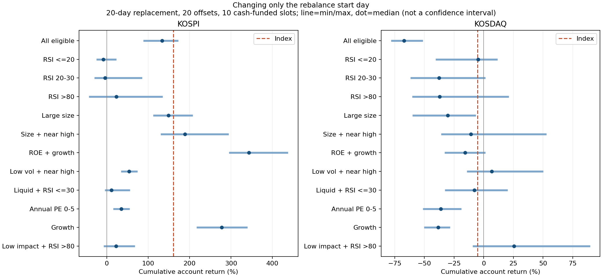

# 추가 연구: 세 조건·매수 방식·국면·실제 자본·교체 날짜

2026-10-04 / Codex 독립 계산. [이전 조건 탐색](REPLY_20261004_condition_sweep.md)의 후속이다. 운영 점수·판정·배치·DB는 변경하지 않았다.

## 1. 이번에 더 확인한 결론

**연구 범위를 더 넓혀 계산과 검산을 완료했다. 조건을 많이 붙이는 것보다 ‘진입 시점·현금 비중·교체 날짜·가격 자료의 당시 정보’가 결과를 크게 바꿨다.**

- 세 조건 204,000개를 추가 계산했지만 과거의 좋은 조합이 2026년에도 이어지는 비율은 제한적이었다. 코스닥의 과거 통과 조합 9,952개 중 2026 평균 수익 양수는 1,669개였다.
- 같은 공통 표본에서 코스닥 RSI≤20은 다음 날 시가 진입 +0.40%, 다음 날 종가 진입 −1.29%였다. ‘언제 사는지’가 빠진 RSI 설명은 불완전하다.
- ‘싸게 기다려서 산다’도 자동 개선책이 아니었다. 5% 할인 지정가는 체결률을 줄였고, 체결된 종목의 중간 손실이 더 커지는 사례가 있었다.
- 계좌로 계산하면 일별 산술평균이 양수인데도 누적 수익은 음수가 될 수 있었다. 코스닥 시총 상위·20일 교체의 한 시작 위치는 일평균 +0.0174%였지만 누적 −26.07%였다.
- 좋은 누적 수익과 편안한 우상향은 달랐다. 코스피 ROE·이익 증가 상위 계좌의 한 시작 위치는 누적 +295.02%였지만 최대 하락은 −39.58%였고, 일별 지수 대비 차이의 탐색 구간은 0을 포함했다. **이 숫자를 검증된 추천 수익으로 제시하지 않는다.**

## 2. 완료 범위와 아직 아닌 것

| 실험 | 완료 범위 |
|---|---:|
| 세 조건 교차 | 장기 지표 18개에서 3개 선택 × 5분위 세 칸 × 2시장 = 204,000개 |
| 세 조건 연도별 행 | 전체·2024·2025·2026 = 816,000행 |
| 진입·보유·시장 상태 | 진입 5방식 × 보유 7기간 × 고정 조건 12개 × 2시장, 연도·국면 포함 6,720행 |
| 거래대금순 상위 10개 종목 평균 | 192행 |
| 현금·10칸 계좌 | 12조건 × 2시장 × 교체 3주기 × 국면 제한 2가지 × 비용 3가지 = 432개 |
| 교체 시작 위치 전수 | 편도 비용 0.25%, 5/10/20일 주기의 모든 시작 위치 = 1,680개 |
| 계좌 독립 구현 대조 | 원래 시작 위치 144개 일치 |
| 업종 기록 | 당시 기록으로 연결한 18,016건·47일·38업종 |

계좌 432개와 시작 위치 1,680개는 144개가 겹친다. 서로 독립된 실험 건수라고 합산하지 않는다. 이전 149개 지표 전체의 모든 세 조건 조합을 계산한 것은 아니다. 이번 세 조건은 장기 자료가 있는 18개 지표에 대한 전수다. 전체 정의는 `PLAN.md`와 `extension_meta.json`에 있다.

모든 숫자 경계·모든 조건 개수·모든 투자 방식을 끝없이 만들 수 있으므로 ‘가능한 방식 전체를 완료했다’고 말할 수 없다. 완료된 범위와 미확인 범위를 구분한다.

## 3. 세 조건을 붙여도 좋은 결과만 남지는 않았다

2024·2025 각각 200건·40일 이상이고 같은 날 비교군 대비 평균 수익과 동시 만족 차이가 양수였던 조합을 골랐다. 동시 만족은 이전 연구의 20% 수익·첫날 상승·중간 손실·진입가 위 체류 조건 그대로다. 빈 칸과 실패도 전체 계산에는 포함했다.

| 시장 | 세 조건 수 | 과거 통과 | 2026 두 상대 차이 양수 | 2026 평균 수익 양수 |
| --- | --- | --- | --- | --- |
| kospi | 102000 | 11399 | 6142 | 6413 |
| kosdaq | 102000 | 9952 | 4793 | 1669 |

대표 20개씩은 **2024·2025 중 낮은 상대 수익이 높은 순서**로 골랐다. 2026 성적을 보고 대표를 정하지 않았다. 다만 2026 자료 자체는 이미 여러 연구에서 봤으므로 완전히 새로운 시험 자료가 아니다.

사례:

- 코스피 과거 첫 조합(20일 변동성 5분위·현금흐름 수익률 4분위·부채비율 5분위)은 2026년 453건·150일에서 평균 −5.82%, 95% 탐색 구간 −11.80~+1.39%였다.
- 코스피 시총 5분위·영업이익 증가 5분위·영업이익/시총 3분위는 447건·157일에서 +10.02%였지만 구간은 −1.96~+20.83%였다. 같은 날짜·같은 시총 구간 대조 차이는 +8.14%p, 구간 +0.11~+16.52%p. 가장 기여가 큰 종목을 빼면 +6.05%, 달을 빼면 +5.18%였다. 추가 점검 후보지만 탐색 횟수 보정을 하지 않은 결과다.
- 코스닥 60일 변동성 2분위·거래대금 5분위·이익 증가 1분위는 135건·109일에서 +11.74%로 좋아 보였다. 하지만 가장 기여가 큰 종목을 빼면 +0.80%, 달을 빼면 −1.39%였다. 평균 수익 구간도 −16.94~+29.54%였다.

각 조합에서 조건 하나씩 뺀 부모 조합과 비교해 세 번째 조건의 추가 효과도 확인했다. 전체 시장 평균보다 낫다는 이유만으로 조건 세 개가 모두 필요하다고 판단하지 않았다.

주식 수가 인접 날짜에 1.5배 넘게 늘거나 2/3 미만으로 줄었던 152종목을 제외하는 민감도 검사도 했다. 이는 전체 기간을 본 **사후 자료 품질 점검**이며, 미래 변화를 알 수 있는 매매 필터가 아니다. 최신 운영 점검의 ‘137종목’과는 탐지 자료·기준이 달라 동일한 목록이라고 주장하지 않는다.

## 4. 매수 시점을 바꾸면 반등이 사라지기도 한다

조건별 기간 차이를 줄이려고 모든 진입 방식에서 60일 결과까지 있는 공통 목록 날짜 **20240102~20260702·608일**을 사용했다. 이전 644일 결과와 표본이 달라 숫자가 조금 다르다. 보유는 5·10·15·20·30·40·60일, 비용 0.5%p다.

코스닥 RSI14≤20의 20일 결과:

| 진입 | 체결 건수 | 목록 날짜 | 가상 체결률 % | 평균 수익 % | 구간 하단 | 구간 상단 | 20% 비율 | 미체결 현금 포함 % |
| --- | --- | --- | --- | --- | --- | --- | --- | --- |
| 다음 날 시가 | 1636 | 422 | 100.00 | 0.40 | -3.62 | 4.60 | 13.14 | 0.40 |
| 다음 날 종가 | 1636 | 422 | 100.00 | -1.29 | -4.77 | 2.83 | 11.25 | -1.29 |
| 3거래일 뒤 시가 | 1633 | 422 | 99.82 | -1.54 | -4.99 | 2.58 | 10.41 | -1.54 |
| 목록 종가보다 2% 낮게 | 1095 | 375 | 66.93 | -0.76 | -5.00 | 4.09 | 13.06 | -0.51 |
| 목록 종가보다 5% 낮게 | 664 | 307 | 40.59 | -0.60 | -5.25 | 5.65 | 12.65 | -0.24 |

구간은 연속 20일 묶음 2,000회 재표집의 95% 탐색 구간이다. 다중 탐색 보정 전이다. 모든 방식의 절대 평균 수익 구간은 0을 포함한다.

지정가는 목록일 종가보다 2% 또는 5% 낮은 가격을 다음 3거래일까지 기다리는 가정이다. 시가가 지정가 아래면 시가, 그렇지 않고 저가가 닿으면 지정가 체결로 가정했다. **일봉 접촉은 실제 주문 체결 증거가 아니다.** 미체결을 현금 0%로 둔 시도당 수익도 함께 기록했다. 이는 서로 겹치는 시도를 포함하므로 실제 계좌 수익이 아니다.

이 비교는 이전 연구에서 다음 날 시가 진입이 가능하고 20일 결과가 있었던 공통 분석군을 출발점으로 삼았다. 원래 다음 날 진입 불가능했던 종목을 새로 포함한 전체 주문 체결률은 아니다. 따라서 다음 날 시가의 100% 체결률을 실제 체결 보장으로 읽으면 안 된다.

시가 진입의 20일은 진입일을 첫날로 센다. 종가 진입은 그 다음 거래일부터 20일을 세므로 청산일도 하루 다르다. 진입 가격만 고정 청산일에서 바꾼 순수 차이로 단정하지 않는다.

## 5. 상승장·하락장: 알 수 있는 조건과 사후 설명을 구분

목록 날짜 당시 해당 시장 지수의 120일선 위/아래와, 나중에 실제로 지수가 올랐는지/내렸는지를 **따로** 계산했다. 후자는 성과 설명용이며 매수 판단에 사용하지 않았다.

예를 들어 코스닥 RSI≤20·다음 날 종가 진입의 20일 수익은 지수 120일선 위에서 −3.42%, 아래에서 +0.02%였다. 이후 실제 지수가 하락했던 표본의 지수 대비 차이는 +3.60%p, 상승했던 표본에서는 −2.75%p였다. 덜 떨어지는 단서와 상승장에서 더 오르는 단서가 같은 조건에서 함께 확인된 것은 아니다.

시가 진입과 지수 종가를 섞는 오류를 줄이기 위해 지수 상대 수익은 **주식과 지수 둘 다 진입일 종가~청산일 종가**로 맞췄다. 시가 진입의 첫날 수익은 이 지수 대비 차이에 포함하지 않는다. 종가 진입은 투자 수익과 지수 비교의 시작 시점이 같다. 가격 지수와 비교하며 배당 재투자는 반영하지 않았다.

## 6. 현금이 제한된 계좌로 바꿔 보기

10칸·각 10%를 목표로 하고, 신호가 부족하면 나머지는 현금이다. 같은 조건 안에서 전일 20일 평균 거래대금 순으로 최대 10개를 골라 다음 날 종가로 거래했다. 5·10·20일마다 교체하고, 현금 차입은 하지 않는다. 거래 불가능한 기존 보유는 평가액을 유지하고 매도를 미뤘다.

교체일에는 거래 가능한 보유를 전량 매도한 후 다시 배분했다. 계속 보유할 종목도 비용을 다시 지불하는 보수적인 ‘전량 교체’ 실험이다. 같은 종목의 유지분 거래를 생략하는 최적화 계좌와는 다르다. 편도 비용은 0.1%, 0.25%, 0.5%를 모두 계산했다.

다음 표는 **시작 위치 하나**, 20일 교체·편도 0.25%·120일선 제한 없음. 기간 2024-01-03~2026-08-26. 종목별 20일 평균과 달리 복리·현금·비용이 반영된 계좌다.

| 시장 | 조건 | 누적 % | 지수 누적 % | 최대 하락 % | 일 산술평균 % | 평균 주식 비중 % |
| --- | --- | --- | --- | --- | --- | --- |
| kospi | 시총 상위 | 135.32 | 161.12 | -44.02 | 0.17 | 100.00 |
| kospi | ROE·이익 증가 상위 | 295.02 | 161.12 | -39.58 | 0.25 | 100.00 |
| kospi | 가격 충격 낮음·RSI>80 | 22.41 | 161.12 | -16.74 | 0.04 | 16.09 |
| kosdaq | 시총 상위 | -26.07 | -5.13 | -67.97 | 0.02 | 100.00 |
| kosdaq | ROE·이익 증가 상위 | -10.03 | -5.13 | -58.53 | 0.03 | 100.00 |
| kosdaq | 가격 충격 낮음·RSI>80 | 30.22 | -5.13 | -13.56 | 0.05 | 15.93 |

높은 숫자에 대한 반증도 확인했다. 코스피 ROE·이익 증가 상위의 일평균은 +0.2494%이고 탐색 구간은 +0.0553~+0.4170%였다. 하지만 **일별 지수 대비 차이**는 +0.0736%p, 구간 −0.0533~+0.1716%p였다. 누적 +295%라는 숫자만으로 지수보다 확실히 낫다고 할 수 없다. 최대 하락 약 40%는 사용자가 말한 편안한 우상향과도 거리가 있다.

코스닥 ‘가격 충격 낮음·RSI>80’은 위 시작 위치에서 최대 하락 −13.56%였지만 평균 주식 비중이 15.93%뿐이었다. 방어 효과 중 현금의 몫을 분리해야 한다. 같은 위험을 지닌 전액 투자 전략보다 우월하다는 결과가 아니다.

**일평균의 함정:** 산술평균은 매일의 비율을 더해 나눈 것이고, 실제 계좌는 곱해진다. 손실과 수익의 폭이 크면 산술평균이 양수여도 최종 자본은 줄어들 수 있다. 따라서 기존 40일 차이를 40으로 나눈 값을 ‘실제 하루 버는 돈’이라고 표시해서는 안 된다.

## 7. 교체 날짜 하나에 기대고 있지는 않은가

한 시작 위치의 좋은 결과를 본 뒤 사후 민감도 점검으로 추가했다. 5일 주기는 5개, 10일은 10개, 20일은 20개 시작 위치를 모두 바꿨다. 편도 비용 0.25%, 총 1,680개 계좌. 다른 날짜는 처음 매매일까지 현금이므로 현금 대기 효과도 일부 포함된다.

아래는 20일 교체·120일선 제한 없음의 20개 시작 위치 범위다. **범위는 신뢰구간이 아니다.**

| 시장 | 조건 | 누적 최솟값 % | 중앙값 % | 최댓값 % | 최악의 낙폭 % | 2026 양수 시작 수 | 시작 위치 수 |
| --- | --- | --- | --- | --- | --- | --- | --- |
| kosdaq | 가격 충격 낮음·RSI>80 | -9.34 | 25.56 | 89.72 | -28.72 | 15 | 20 |
| kosdaq | ROE·이익 증가 상위 | -33.07 | -15.63 | 1.35 | -63.15 | 17 | 20 |
| kosdaq | 시총 상위·고점 근접 | -36.04 | -10.84 | 52.86 | -72.31 | 7 | 20 |
| kospi | 가격 충격 낮음·RSI>80 | -7.73 | 22.87 | 67.85 | -25.89 | 17 | 20 |
| kospi | ROE·이익 증가 상위 | 295.02 | 343.51 | 437.63 | -43.18 | 20 | 20 |
| kospi | 시총 상위·고점 근접 | 130.05 | 188.68 | 294.41 | -46.58 | 20 | 20 |

**남은 긍정적인 단서:** 코스피 ROE·이익 증가 상위는 20개 시작 위치 모두에서 누적 수익이 양수였고 범위는 +295.02~+437.63%였다. 따라서 이 사례는 시작일 하나를 잘 골라서만 나온 결과는 아니었다. 하지만 가장 나쁜 최대 하락은 −43.18%였고, 같은 조합의 코스닥 중앙값은 −15.63%였다. 시장별 차이와 손실 위험을 지운 채 보편적인 전략으로 일반화할 수 없다.



원래 계좌와 별도로 보유 종목만 관리하는 구현을 작성해 144개 원래 시작 위치를 대조했다. 누적 수익 최대 차이 1.08e-12%p로 일치했다. 두 구현이 같은 원자료와 실험 가정을 쓰므로 데이터 편향까지 독립 검증한 것은 아니다.

## 8. 업종: 현재 자료로 할 수 있는 범위

기본 스크리너의 당시 업종 값은 2026-09-08·09 이틀에만 남아 있어 이번 공통 분석 기간에 연결되는 값이 없었다. 최신 업종을 과거 전체에 복사하지 않았다.

대형 종목군에 저장된 **업종 메타데이터만** 연결하면 18,016건·47일·38업종이 남았다(20260610~20260825). `sector_large_metadata.csv`에 업종별 수익·20% 비율·손실을 남겼다. 대형 모델의 점수·판정과 다른 트랙을 비교한 것이 아니며, 전체 시장 업종 3년 검증도 아니다. 47일에서 보유 창이 겹치므로 업종 승자를 확정하지 않는다.

## 9. 검산과 한계

- 무작위 세 조건 집계 120개를 원행에서 다시 계산했다. 비교군 차이 최대 오차 5.11e-07%p.
- 진입 방식 가격 경로 100개를 직접 확인했다. 수익 차이 0.
- 계좌 일평균 1,728개를 저장된 평가액 경로에서 다시 계산했다.
- 계좌 원래 시작 위치 144개는 별도 구현으로 대조했다. 모든 계좌에서 현금 음수를 허용하지 않는 검사를 실행했다.
- 상세 구간은 20일 묶음 재표집 2,000회다. 수십만 조건 전체를 통합 보정한 공식 판정이 아니다. 자료가 짧은 구간의 좁은 오차 범위도 강한 증거가 아니다.
- 현재의 가격 패널·공시 이력·주식 수를 사용했다. 과거 전체 상장·폐지·편입 이력, 수정주가와 주식 수의 완전한 일관성, 모든 공시 최초 공개 시각, 실제 호가와 체결을 재구축하지 않았다. 기존 연구 분석군의 선택도 그대로 물려받았다.
- 계좌는 배당·세목별 실제 세율·거래량별 체결 충격·현금 이자를 따로 계산하지 않고 비용 가정으로 비교했다. 지수 투자상품의 거래비용도 별도로 반영하지 않았다.
- 이미 본 자료에서 다시 찾은 결과다. 지금 가장 좋아 보이는 조합으로 운영 모델을 바꾸거나, 새 기준을 채택하지 않았다.

## 10. 다음 연구에서 우선할 것 — 의견

1. **급등 목록과 우상향 계좌를 별개로 평가:** 20% 적중률이 높은 목록과 낮은 낙폭의 계좌를 같은 점수로 순위 매기지 않는 편이 목적에 맞다. 이번에는 둘이 일치하지 않는 사례를 확인했다.
2. **관찰할 후보는 적게, 반증은 강하게:** 코스피 재무·유동성 조합, 코스닥 과매도 단기 반등을 서로 다른 가설로 남긴다. 지금 발견한 가장 좋은 칸을 새 규칙으로 확정하지 않는다.
3. **원자료 보강이 다음 병목:** 당시 업종, 주식 수·수정주가 일치, 최초 실적 공시, 실적 예상치와 실제 차이, 상장폐지를 포함한 과거 투자 가능 목록이 필요하다. 추가 수집기는 실행하지 않았다.
4. **계좌 후속 반증:** 현금 비중을 맞춘 지수 대조, 거래대금순 선정 효과, 동일 종목 유지분 매매 생략, 지수 상태 변경 즉시 축소와 정기 교체의 차이, 실제 거래비용과 분봉 체결을 구분해 확인할 가치가 있다. 이번 보고서가 이 항목들까지 완료했다는 뜻은 아니다.

많은 조건에서 가장 좋아 보이는 결과를 고를수록 우연의 몫이 커진다는 설명은 [Harvey·Liu·Zhu의 다중 팩터 연구](https://www.nber.org/papers/w20592)를 참고했다. 이번 숫자는 논문에서 가져온 것이 아니라 로컬 자료로 계산한 값이다.

## 11. 파일과 재현

결과 폴더: `research/target20_extended_20261004/`.

- `triple_counts.csv`, `past_triples_*.csv.gz`, `triple_representatives.csv`: 과거 선택의 유지 여부와 반증.
- `share_jump_sensitivity.csv`: 주식 수 급변 종목 제외 점검.
- `entry_horizon_regime.csv`, `top10_liquidity.csv`: 진입·보유 기간·시장 상태·상위 10개 평균.
- `portfolio_results.csv`, `portfolio_daily_intervals.csv`, `portfolio_curves.csv.gz`: 실제 자본 제한 계좌·일평균 구간·평가액.
- `rebalance_phases.csv`, `phase_summary.csv`, `rebalance_sensitivity.png`: 모든 교체 시작 위치.
- `sector_large_metadata.csv`, 각 `*_meta.json`, `validation.json`, `phase_validation.json`: 업종 범위와 검산 기록.

재현 순서(NumPy·pandas·Parquet 지원·Matplotlib 필요):

```powershell
python research/handoff/code_target20_conditions_build.py --output research/target20_extended_20261004
python research/handoff/code_target20_extended_triples.py
python research/handoff/code_target20_extended_execution.py
python research/handoff/code_target20_extended_portfolio.py
python research/handoff/code_target20_extended_validate.py
python research/handoff/code_target20_extended_phases.py
python research/handoff/code_target20_extended_report.py
```

용량 규칙에 따라 보고서·요약·검산 완료 후 큰 중간 파일 `outcomes.parquet`, `feature_quintiles.parquet`, `absolute_values.parquet`, `triples_kospi.csv.gz`, `triples_kosdaq.csv.gz`는 정리한다. 전체 조합은 위 코드로 다시 계산할 수 있다. 보존 파일 목록·크기는 `artifact_manifest.csv`에 기록한다. 평일 배치 금지 시간에는 재실행하지 않는다.
