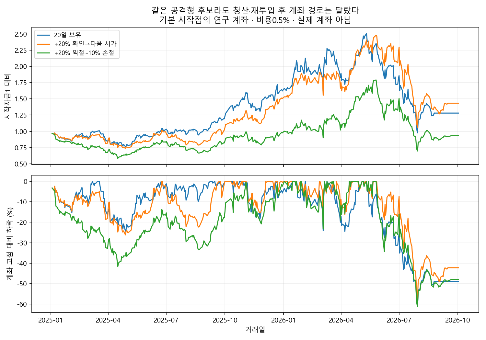

# +20% 연구 후속: 진입·청산·반복 매수·고정자금

2026-10-04 · Codex 독립 연구 · 기존 모델/운영 코드/DB/사전등록 변경 없음.

## 1. 추가 연구의 답

**조금 더 구체적인 개선 단서는 나왔다. 하지만 원래 목표를 달성한 선별법은 여전히 아니다.**

1. 공격형에서 +20% 확인 후 다음날 시가에 매도하면, 청산수익 +20% 이상 비율은23.4%→33.1%로 증가했다. 대신 평균 묶음 수익은4.05%→3.27%로 낮아졌다. 큰 수익을 일찍 잘라 생기는 맞교환이다. 평균 차이의95% 구간은0을 포함한다.
2. −10% 손절을 붙이면 개별 거래의 낙폭은 줄었지만, 고정자금 계좌 낙폭까지 자동으로 줄지 않았다. **손절 후 언제 다시 사는지**가 빠져 있었다.
3. 기본 계좌는 손절한 바로 그날 같은 종목을 다시 살 수 있었다. 공격형의 기본 시작점에서52회였다. 당일 및 이후5거래일 재진입 금지를 추가하니 같은 시작점 계좌 낙폭이−61.0%→−50.2%로 줄었다. 여전히 사용자 목표와 거리가 크며, 이 개선은 결과를 본 뒤 추가한 탐색이다.
4. 첫날 양봉을 보고 진입하는 간단한 확인 조건은 목표 적중률을 거의 바꾸지 못했다. “하루 오른 것을 확인하면 안전하다”는 근거는 남지 않았다.

내 의견: 다음 연구의 단위는 점수 하나보다 **목록→실제 진입→청산→재진입**의 한 묶음이어야 한다. “+20% 도달 종목을 고른다”와 “그 수익을 얻고 다시 잃지 않는다”는 다른 문제였다.

## 2. 계산 규약

이전26개 중 거래대금 상위10·고베타+고점 근접·가격4요소 대조만 고정했다. 운영 모델 그 자체의 재현은 아니다. 신규 점수식이나 임계값 탐색은 하지 않았다.

- 목록일2025-01-02~2026-08-25, **400일**. 출구 지연과 하루 늦은 진입을 끝까지 확인하려고 마지막26거래일을 비웠다. 전일 보고서406일과 기간이 다르다.
- 기본 진입은 다음날 시가, 비용0.5% 차감. 진입 불가 슬롯은 현금. 평균 묶음 수익은10개 슬롯 기준이다.
- 목표청산: 보유5~19일째 **종가**에서 비용 후+20% 확인→다음날 **시가** 매도. 20일째는 예정된 만기 종가 청산. 장중 최고가에서 팔았다고 가정하지 않는다.
- 손절:1~19일째 종가 비용 후−10% 이하→다음 시가. 손실이−10%에서 제한된다는 가정이 아니다.
- 되밀림 청산:5일 이후+20%가 확인되면 활성화, 이후 최고 종가 대비10% 하락 확인→다음 시가. 만기는20일 그대로다.
- 거래량0·종일 하한가 의심 등 매도 곤란 시 최대5거래일 지연. 미해결은 평가액과 전손 민감도를 구분한다. 정확한 호가 체결 재현은 아니다.
- CI는20일 날짜 블록2,000회 재추출. 보유 창·반복 종목·기존 자료의 선택 편향은 남는다. 다중 시험 보정된 채택 검정이 아니다.

종가 확인과 다음 시가 체결을 구분한 이유는 신호 가격이 체결 가격을 보장하지 않기 때문이다. [SEC 투자자 안내](https://www.investor.gov/introduction-investing/general-resources/news-alerts/alerts-bulletins/investor-bulletins-15)도 이 차이를 설명한다. 본 시험은 한국 증권사의 특정 주문 기능을 구현한 것이 아니라 일봉으로 만든 청산 가정이다.

## 3. 익절·손절 결과 — 실측

| 후보 | 청산 | 편입 수 | 평균 묶음 수익% [95% 구간] | 청산 +20% 비율 [95% 구간] | 평균 종목 낙폭 | 기본 대비 차이%p [95% 구간] |
| --- | --- | --- | --- | --- | --- | --- |
| 거래대금 상위10 | 20일 보유 | 3996 | +4.39 [-0.30, +8.51] | 18.1% [12.2, 25.0] | -15.81% | +0.00 [+0.00, +0.00] |
| 거래대금 상위10 | +20% 확인→다음 시가 | 3996 | +3.45 [-0.30, +6.67] | 23.1% [17.2, 30.7] | -13.82% | -0.95 [-2.29, +0.44] |
| 거래대금 상위10 | +20% 익절·−10% 손절 | 3996 | +2.86 [-0.12, +5.76] | 21.4% [15.6, 28.8] | -11.03% | -1.53 [-3.42, +0.83] |
| 거래대금 상위10 | +20% 이후10% 되밀림 | 3996 | +4.36 [-0.18, +8.30] | 17.8% [12.3, 24.3] | -15.21% | -0.03 [-0.49, +0.48] |
| 가격4요소 대조 | 20일 보유 | 4000 | +1.05 [-0.96, +2.99] | 3.4% [1.4, 6.0] | -6.36% | +0.00 [+0.00, +0.00] |
| 가격4요소 대조 | +20% 확인→다음 시가 | 4000 | +1.13 [-0.78, +2.97] | 4.6% [2.0, 8.2] | -6.09% | +0.07 [-0.11, +0.32] |
| 가격4요소 대조 | +20% 익절·−10% 손절 | 4000 | +1.18 [-0.57, +2.98] | 4.6% [2.0, 8.2] | -5.78% | +0.13 [-0.23, +0.67] |
| 가격4요소 대조 | +20% 이후10% 되밀림 | 4000 | +1.10 [-0.89, +3.01] | 3.4% [1.4, 6.0] | -6.30% | +0.04 [-0.00, +0.12] |
| 고베타·고점 근접 | 20일 보유 | 3985 | +4.05 [-1.44, +9.70] | 23.4% [17.9, 30.0] | -21.78% | +0.00 [+0.00, +0.00] |
| 고베타·고점 근접 | +20% 확인→다음 시가 | 3985 | +3.27 [-0.79, +7.39] | 33.1% [27.3, 40.1] | -18.32% | -0.78 [-2.74, +0.99] |
| 고베타·고점 근접 | +20% 익절·−10% 손절 | 3985 | +2.03 [-0.72, +5.26] | 27.2% [22.0, 33.5] | -12.91% | -2.02 [-5.03, +1.36] |
| 고베타·고점 근접 | +20% 이후10% 되밀림 | 3985 | +3.86 [-1.15, +8.98] | 23.1% [17.9, 29.4] | -20.42% | -0.19 [-1.05, +0.64] |

모든 행은 동일400개 목록일이다. 편입 건수는 독립 표본 수가 아니다. 종목 평균 최대 낙폭과 계좌 최대 낙폭은 다르다.

공격형 목표청산의 성공 비율 증가는 **+9.69%p [동일 날짜 블록95% 구간 +7.82, +11.90]**였다. 같은 자료 안에서는 분명한 변화다. 다만 높은 적중률이 더 높은 평균 수익을 의미하지 않으며, 새 기간의 재현은 아직 확인하지 못했다.

공격형 목표청산 신호1,434건 중 **158건(11.0%)은 실제 가정 청산수익이+20% 미만**이었다. 목표 확인 다음날 시가가 달라지기 때문이다. 거래대금 대조는1,053건 중159건이었다. “목표를 한 번 찍었다”를 전부 성공 청산으로 계산하면 과대평가된다.

공격형 손절2,210편입 관측의 가정 청산손실 평균은−12.89%였다. 가장 큰 손실은 패널상−80.82%였다. 예를 들어288330의2025-03-26 목록은3/27 시가7,700원 진입,4/15부터 연속 단일가격 하한가 의심 구간을 거쳐4/21 시가1,515원 청산으로 계산됐다. **이는 원시 패널 경로 확인이며 실제 주문 체결 검증은 아니다.** 손절선을그대로 체결가로 쓰지 않은 결과다.

미해결 매도가 있는 방식은 가격4요소 기본13건, 공격형 기본11건 등이다. 이 관측에서+20% 성공으로 잡힌 건은0건이었다. 미해결을 전손으로 바꾸면 공격형20일보유 평균4.05%→3.86%, 가격4요소1.05%→0.72%. 미해결 평가액을 확정 수익이라고 부르지 않는다.

### 연도에 따라 이익과 손해가 달라졌다

| 공격형 청산 | 연도 | 목록일 수 | 평균 묶음 수익% [95% 구간] |
| --- | --- | --- | --- |
| 20일 보유 | 2025 | 242 | +7.36 [+0.96, +13.88] |
| 20일 보유 | 2026 | 158 | -1.02 [-11.22, +5.94] |
| +20% 확인→다음 시가 | 2025 | 242 | +5.00 [+0.75, +9.20] |
| +20% 확인→다음 시가 | 2026 | 158 | +0.62 [-7.99, +6.01] |
| +20% 익절·−10% 손절 | 2025 | 242 | +2.70 [-0.63, +6.71] |
| +20% 익절·−10% 손절 | 2026 | 158 | +1.00 [-4.15, +4.46] |
| +20% 이후10% 되밀림 | 2025 | 242 | +6.67 [+0.98, +12.16] |
| +20% 이후10% 되밀림 | 2026 | 158 | -0.44 [-9.83, +5.88] |

공격형 익절은2025의 큰 이익을 줄이고2026의 손실을 줄였다. 이를 보고2025에는보유,2026에는익절을 선택한 성적은 만들지 않았다. 다음 기간에 어느 쪽이 유리한지 알아내는 별도 정보가 필요하다.

## 4. 첫날 오른 것을 보고 사면 달라졌나

| 후보 | 진입 | 편입 수 | 평균 사용 자리/10 | 평균 묶음 수익% [95% 구간] | +20% 비율 |
| --- | --- | --- | --- | --- | --- |
| 거래대금 상위10 | 다음날 시가 | 3996 | 9.99 | +4.39 [-0.30, +8.51] | 18.1% |
| 거래대금 상위10 | 첫날 양봉이면 하루 뒤 진입 | 1818 | 4.54 | +2.22 [-0.10, +4.30] | 19.3% |
| 거래대금 상위10 | 무조건 하루 더 기다림 | 3999 | 10.00 | +4.26 [-0.42, +8.32] | 18.0% |
| 가격4요소 대조 | 다음날 시가 | 4000 | 10.00 | +1.05 [-0.96, +2.99] | 3.4% |
| 가격4요소 대조 | 첫날 양봉이면 하루 뒤 진입 | 1962 | 4.91 | +0.52 [-0.68, +1.67] | 4.1% |
| 가격4요소 대조 | 무조건 하루 더 기다림 | 4000 | 10.00 | +1.02 [-0.99, +3.01] | 3.5% |
| 고베타·고점 근접 | 다음날 시가 | 3985 | 9.96 | +4.05 [-1.44, +9.70] | 23.4% |
| 고베타·고점 근접 | 첫날 양봉이면 하루 뒤 진입 | 1735 | 4.34 | +2.05 [-0.52, +4.80] | 23.6% |
| 고베타·고점 근접 | 무조건 하루 더 기다림 | 3987 | 9.97 | +4.20 [-1.41, +9.84] | 22.8% |

같은400개 목록일, 실제 진입일부터20거래일이다. 확인 전에 오른 수익은 포함하지 않았다. 양봉 조건으로 탈락한 몫은 현금이며, 현금 비중 감소 때문에 묶음 수익이 달라질 수 있다.

공격형 적중률은무조건 하루 늦음22.8%, 첫날 양봉 확인23.6%. 단순 확인이 큰 구분력을 보였다고 하기 어렵다. 신호를 보고 기다리는 전략을 시험할 때는 **무조건 같은 만큼 기다리는 대조**가 필요하다. 다음날 시가 대조와만 비교하면 기다린 효과와 확인 조건의 효과가 섞인다.

## 5. 돈이 한정된 계좌로 바꾸면

처음 자금1, 최대10종목, 보유 중 같은 종목 추가매수 금지. 어제 상위10 안에서만 빈 자리를 채운다. 신규 매수당 현재 시가 평가자산의최대10%, 차입 없음. 팔린 자금은 재사용한다. 소수점 주식·동일 시가 청산대금 재사용·시장충격 없음의 이상화된 연구 계좌다. 실제 계좌 성적이 아니다.

평가 기간2025-01-03~2026-10-02, **425거래일**. 신규 매수는목록 마지막 날 다음날까지만 허용하고 끝까지 청산한다. 거래정지 미해결은 평가로 남는다. 각 누적수익 옆 범위는 일별 수익을20일씩 재배열한95% 범위이며, 같은 전략을 재실행한 미래 성과 예측 구간이나 독립 계좌 실험이 아니다.

| 후보 | 청산 | 진입 거래 수 | 누적 수익% [블록 재추출95% 범위] | 계좌 최대 낙폭 |
| --- | --- | --- | --- | --- |
| 거래대금 상위10 | 20일 보유 | 200 | +173.92 [-19.24, +697.00] | -46.42% |
| 거래대금 상위10 | +20% 확인→다음 시가 | 242 | +173.15 [-15.52, +645.27] | -45.84% |
| 거래대금 상위10 | +20% 익절·−10% 손절 | 358 | +136.63 [-34.19, +600.32] | -49.36% |
| 거래대금 상위10 | +20% 이후10% 되밀림 | 212 | +141.66 [-32.62, +630.37] | -49.60% |
| 고베타·고점 근접 | 20일 보유 | 200 | +28.14 [-65.14, +423.84] | -61.06% |
| 고베타·고점 근접 | +20% 확인→다음 시가 | 253 | +43.34 [-61.51, +520.97] | -57.44% |
| 고베타·고점 근접 | +20% 익절·−10% 손절 | 510 | -6.68 [-75.21, +364.29] | -61.04% |
| 고베타·고점 근접 | +20% 이후10% 되밀림 | 218 | +36.44 [-70.37, +608.47] | -63.07% |
| 가격4요소 대조 | 20일 보유 | 198 | +29.05 [-19.62, +112.17] | -21.99% |
| 가격4요소 대조 | +20% 확인→다음 시가 | 207 | +20.28 [-28.86, +103.40] | -23.88% |
| 가격4요소 대조 | +20% 익절·−10% 손절 | 216 | +29.25 [-17.35, +113.06] | -19.59% |
| 가격4요소 대조 | +20% 이후10% 되밀림 | 199 | +28.30 [-20.14, +111.72] | -21.93% |

기본 시작점의 공격형은20일보유 계좌 낙폭−61.1%, 익절 계좌−57.4%, 익절+손절 계좌−61.0%. 개별 거래에서 낙폭을 줄여도 반복 손실과 재투입으로 계좌 낙폭은 클 수 있다.

거래대금 대조의 큰 누적수익도 바로 신뢰하지 않았다. 처음 시작을0~19거래일 늦춘20개 경우를 모두 계산했다. 시작 전에는현금, 종료일은동일하다. 아래 범위는 **시작일 민감도**이지 신뢰구간이 아니다.

| 후보 | 청산 | 시작점20개 누적수익 최소~최대 | 누적수익 중앙값 | 계좌 낙폭 중앙값 |
| --- | --- | --- | --- | --- |
| 거래대금 상위10 | 20일 보유 | +54.72% ~ +178.67% | +92.40% | -47.27% |
| 거래대금 상위10 | +20% 확인→다음 시가 | +79.75% ~ +173.15% | +111.85% | -45.84% |
| 거래대금 상위10 | +20% 익절·−10% 손절 | +94.20% ~ +153.53% | +113.73% | -49.36% |
| 거래대금 상위10 | +20% 이후10% 되밀림 | +74.93% ~ +144.10% | +105.71% | -49.18% |
| 가격4요소 대조 | 20일 보유 | +9.21% ~ +30.78% | +17.90% | -22.87% |
| 가격4요소 대조 | +20% 확인→다음 시가 | +7.45% ~ +30.39% | +18.11% | -23.38% |
| 가격4요소 대조 | +20% 익절·−10% 손절 | +19.31% ~ +39.01% | +31.97% | -19.07% |
| 가격4요소 대조 | +20% 이후10% 되밀림 | +9.21% ~ +40.12% | +23.44% | -21.97% |
| 고베타·고점 근접 | 20일 보유 | -10.23% ~ +160.98% | +65.27% | -58.84% |
| 고베타·고점 근접 | +20% 확인→다음 시가 | -24.42% ~ +126.21% | +50.53% | -54.54% |
| 고베타·고점 근접 | +20% 익절·−10% 손절 | -6.68% ~ +55.52% | +11.96% | -61.04% |
| 고베타·고점 근접 | +20% 이후10% 되밀림 | +21.60% ~ +167.17% | +106.17% | -58.78% |

공격형20일 보유의 누적수익은 시작점에 따라−10.2%~+161.0%였다. 특정 시작점의 좋은 그림만 선택할 수 없다. 20개 경로는 대부분 같은 시장을 공유하므로20번의 독립 검증도 아니다.

## 6. 새로 발견한 문제: 손절 직후 재매수

손절만 정하고 재진입을 정하지 않으면, 어제 목록에 남은 종목을 매도한 시가에 다시 사는 일이 생긴다. 이번 모의계좌에서는 실제로 발생했다. 이 조건은 그동안의 운영 코드 버그를 발견했다는 뜻이 아니라 **이번 연구 계좌의 최초 명세에 허용된 동작**이다.

결과를 본 뒤 손절 당일 및 이후5거래일 같은 종목 진입 금지 변형을 추가했다. 5일이 최적이라는 근거는 없고 값은 다시 조정하지 않았다.

| 후보 | 손절 후 재진입 | 진입 수 | 손절 당일 재매수 수 | 누적수익% [블록 재추출95% 범위] | 계좌 최대 낙폭 |
| --- | --- | --- | --- | --- | --- |
| 거래대금 상위10 | 즉시 허용 | 358 | 123 | +136.63 [-34.19, +600.32] | -49.36% |
| 거래대금 상위10 | 당일+이후5일 금지 | 315 | 0 | +94.47 [-33.28, +417.37] | -37.71% |
| 가격4요소 대조 | 즉시 허용 | 216 | 1 | +29.25 [-17.35, +113.06] | -19.59% |
| 가격4요소 대조 | 당일+이후5일 금지 | 217 | 0 | +27.79 [-18.66, +111.50] | -20.24% |
| 고베타·고점 근접 | 즉시 허용 | 510 | 52 | -6.68 [-75.21, +364.29] | -61.04% |
| 고베타·고점 근접 | 당일+이후5일 금지 | 464 | 0 | +47.11 [-55.75, +537.60] | -50.24% |

| 후보 | 대기일 | 20시작점 수익 최소~최대 | 수익 중앙값 | 낙폭 중앙값 |
| --- | --- | --- | --- | --- |
| 거래대금 상위10 | 0 | +94.20% ~ +153.53% | +113.73% | -49.36% |
| 거래대금 상위10 | 5 | +61.56% ~ +109.72% | +91.21% | -37.71% |
| 가격4요소 대조 | 0 | +19.31% ~ +39.01% | +31.97% | -19.07% |
| 가격4요소 대조 | 5 | +16.65% ~ +41.13% | +29.45% | -18.91% |
| 고베타·고점 근접 | 0 | -6.68% ~ +55.52% | +11.96% | -61.04% |
| 고베타·고점 근접 | 5 | +24.18% ~ +95.79% | +48.30% | -49.55% |

공격형에서는20시작점 모두 재진입 금지 변형의 수익이 양수였지만, 낙폭 중앙값은 여전히−49.5%다. 거래대금 대조에서는낙폭이 줄어드는 대신 수익 중앙값이낮아졌다. 가격4요소에서는일관된 우위가 없었다. 따라서 “5일만 기다리면 해결”이라는 결론은 아니다.

**남길 연구 가설:** 손절 이후 그 종목의 매수 근거가 실제로 새로 생겼는지 확인하는 재진입 조건. 단순히 점수가 아직높다는 이유로 다시 사는 것과 구분해야 한다. 이번5일 대기는 그 문제를 분리하기 위한 첫 시험이다.

## 7. 비용과 관련 연구

같은 매매 일정을 유지한 채 비용만0.5%→1.0%로 늘렸다. 청산 신호를 새 비용에 맞춰 다시 튜닝하지 않았다. 아래는기본 시작점425일, 거래 수는§5 표와 같다.

| 후보 | 청산 | 비용0.5% 누적수익 | 비용1% 누적수익 [재추출95% 범위] |
| --- | --- | --- | --- |
| 거래대금 상위10 | 20일 보유 | +173.92% | +148.72 [-27.11, +627.75] |
| 거래대금 상위10 | +20% 확인→다음 시가 | +173.15% | +142.63 [-24.95, +561.13] |
| 거래대금 상위10 | +20% 익절·−10% 손절 | +136.63% | +99.30 [-45.44, +492.82] |
| 거래대금 상위10 | +20% 이후10% 되밀림 | +141.66% | +118.30 [-39.34, +559.67] |
| 가격4요소 대조 | 20일 보유 | +29.05% | +16.99 [-27.67, +93.54] |
| 가격4요소 대조 | +20% 확인→다음 시가 | +20.28% | +8.53 [-35.95, +83.93] |
| 가격4요소 대조 | +20% 익절·−10% 손절 | +29.25% | +16.22 [-26.46, +91.19] |
| 가격4요소 대조 | +20% 이후10% 되밀림 | +28.30% | +16.25 [-27.90, +92.31] |
| 고베타·고점 근접 | 20일 보유 | +28.14% | +15.91 [-68.90, +376.98] |
| 고베타·고점 근접 | +20% 확인→다음 시가 | +43.34% | +26.06 [-66.25, +447.95] |
| 고베타·고점 근접 | +20% 익절·−10% 손절 | -6.68% | -27.08 [-81.11, +272.22] |
| 고베타·고점 근접 | +20% 이후10% 되밀림 | +36.44% | +22.37 [-73.69, +538.01] |

[Kaminski·Lo(2014)](https://doi.org/10.1016/j.finmar.2013.07.001)는 손절의 가치가 가격의 움직임과 정책에 달려 있다고 분석한다. 모든 시장에서 손절이 기대수익을 높인다는 주장이 아니며, 논문의 지수선물 시험은 이번 개별주식 시험과 다르다. [후속 연구](https://www.sciencedirect.com/science/article/pii/S1386418117300472)도 청산만으로 전략이 완성되지 않고 재진입 규칙이 필요함을 다룬다. 이 자료들은 이번 결과의 승인을 대신하는 근거가 아니라 연구 질문을 정리하는 참고다.

## 8. 다음 방향에 대한 의견

- **유지할 것:** +20% 절대 목표, 실제 진입가 기준, 체결 시차, 거래대금 대조, 실패 결과 공개.
- **바꿀 연구 구조:** 후보의 목표 도달률과 계좌의 자금 재사용을 분리해 검증. `관찰→진입→보유→청산→재진입 대기` 상태를 명시. 운영 적용 제안이나 새 모델 등록이 아니다.
- **이번에 남은 단서:** 목표청산은 성공 청산 횟수를 늘릴 수 있음, 재진입 제한은 일부 공격형의 반복 손실을 줄일 수 있음. 평균수익·기회손실과 함께 평가해야 한다.
- **아직 못 얻은 것:** 다음날부터 안정적 상승, 하락장 방어와 상승장 초과상승을 동시에 만족하는 목록. 현재 결과로 매수 추천 목록을 내지 않는다.
- **새 정보가 필요한 연구:** 최초 실적 발표·당시 기대치·발표 시각을 이용한 사건 중심 후보, 분봉으로 확인하는 진입. 기존 일봉만으로 검증했다고 꾸미지 않는다.

## 재현 및 한계

기존에 반복 사용한 패널이며 생존 종목 구성·가격 조정·거래정지·상장주식수 역사 등의 한계는전일 보고서와 같다. 현재 결과는 새로운 미사용 검증이 아니다. 실제 증권사 체결·분할매도·호가 충격·정수주 매수는검증하지 않았다. 계좌의 시가 평가비중은 이상적인 목표 금액 배분이다. 비용 차감·재진입 시점·사용 가능한 자금을 명시한 모의시험일 뿐이다.

고정보유 **11,952건**은 기존 독립 계산과 수익 차이0으로 재현했다(정상 출구만 대조). 계좌기본12개를 별도 구현으로 다시 계산했고 누적수익 최대 차이는 약5.7×10⁻¹⁴%p였다. 모든 날 현금 음수없음을 확인했다. 처음 실행의검증 JSON 저장 시 numpy 정수 직렬화 오류는수정 후 재실행해완료했다. 성과 수치 계산 오류는아니었다.

- 계산 전 사양: `research/target20_20261004/PLAN.md`
- 추가 탐색 기록: `research/target20_20261004/ACCOUNT_SENSITIVITY.md`
- 계산: `research/handoff/code_target20_followup.py`
- 별도 계좌 재현·20시작점·재진입 제한: `research/handoff/code_target20_account_check.py`
- 표·그림 생성: `research/handoff/code_target20_followup_report.py`
- 전체 결과: `research/target20_20261004/exit_summary.csv`, `entry_summary.csv`, `account_summary.csv`, `account_sensitivity.csv`, `account_start_ranges.csv`, `hit_intervals.csv`
- 검증 기록: 같은 폴더 `verification.json`, `account_verification.json`

연구용 파일만 추가했다. 수집기·배치·실제 주문 실행, 운영 코드·DB·모델 판정 변경은 없다.

## 도전 카드

**재진입을 새로운 매수로 평가하기.** 기대 이득은 같은 실패 신호에 연속으로 자금을 넣는 일을 구분하는 것이다. 검증은고정5일 대기를 지금 적용하는 대신, 후보 근거가 회복됐다는 단일 조건을 미리 정하고 새로운 기간에 비교하는 방식이다. 조건을 늘려 과거 최고값을 찾는 실험은피한다.
