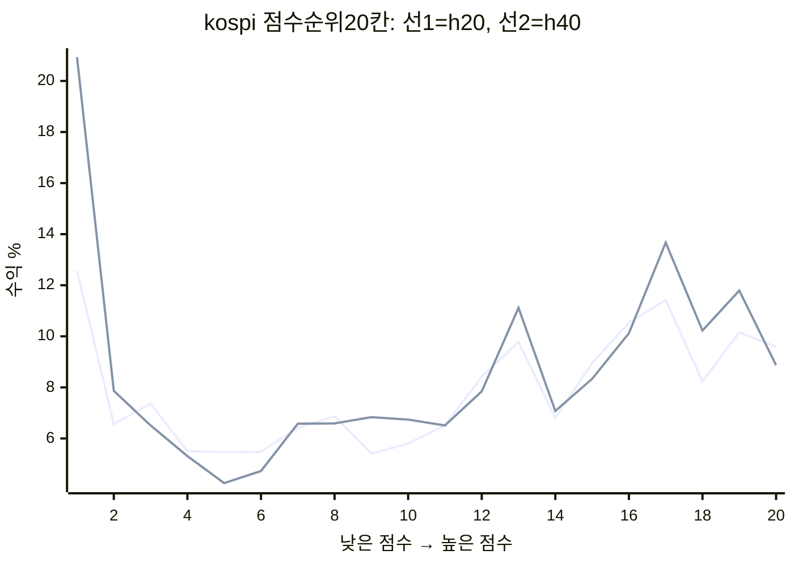
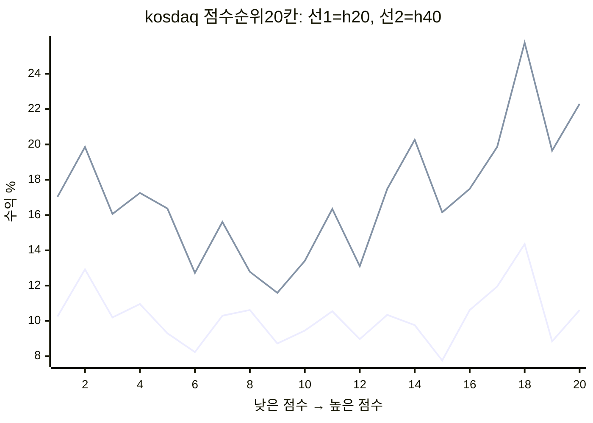

# REPLY — 4. le_a 순위 상관과 상위10 성과

검토 2026-10-09T18:11:53+09:00, 가격 마지막 20261008. 운영 코드·DB·docs 변경 없음. 기존 scoreboard의 완료 n=16개를 독립 재계산했고 평균 수익·시장·초과의 최대 차이 0.000000000000%p로 일치했다.

## 먼저 구분할 수치

요청의 +0.011은 **현재 h20 관측값**이다. 9/13 정본은 le_a h20 **−0.0145, 95% [−0.0436,+0.0152], n=20**, 가격 기준9/11이다. 이번 같은 가격에서 점프컷0.32를 적용한 h20 IC는 n=36일 평균 +0.011281, 날짜 iid95% [-0.016, +0.039]; 완료40일의 같은 n=16일에서는 -0.012293, [-0.046, +0.022]. 전종목 순위의 h20과 꼬리10종목의 h40은 대상·기간·이상치 규칙이 다르다. scoreboard에는 점프컷·희석 제외·과거시점 유니버스 보정이 없다.

이하 수익은 신호 다음 거래일 종가→40거래일 후 종가, 무비용·시장별 동일가중 후 두 시장 평균. 날짜는 **매수 체결일이 아닌 신호 앵커일**이다. h20/40 20칸은 같은 완료 n=16일만 사용해 기간 차이를 고정했다. 순위를 시장×신호일 내 낮은 점수1칸~높은20칸으로 나누고 칸 수익을 날짜 동일가중했다. 동점은 DB행 순서로 분할(전체 IC는 평균순위).

## (1) 20칸 수익 그림과 수치

| 시장 | 보유일 | 칸 | 날짜 n | 유효 자리 n | 평균 % | 날짜 iid95% 참고 |
|---|---|---|---|---|---|---|
| kospi | 20 | 1 | 16 | 397 | +12.576 | [+8.173, +17.742] |
| kospi | 20 | 2 | 16 | 389 | +6.566 | [+4.161, +8.918] |
| kospi | 20 | 3 | 16 | 388 | +7.362 | [+5.016, +9.793] |
| kospi | 20 | 4 | 16 | 386 | +5.507 | [+3.303, +7.689] |
| kospi | 20 | 5 | 16 | 390 | +5.466 | [+3.014, +8.244] |
| kospi | 20 | 6 | 16 | 388 | +5.481 | [+3.276, +7.768] |
| kospi | 20 | 7 | 16 | 388 | +6.418 | [+3.767, +9.140] |
| kospi | 20 | 8 | 16 | 386 | +6.870 | [+4.664, +9.326] |
| kospi | 20 | 9 | 16 | 387 | +5.409 | [+3.256, +7.537] |
| kospi | 20 | 10 | 16 | 388 | +5.799 | [+2.911, +8.741] |
| kospi | 20 | 11 | 16 | 393 | +6.509 | [+3.348, +9.743] |
| kospi | 20 | 12 | 16 | 384 | +8.412 | [+5.260, +11.732] |
| kospi | 20 | 13 | 16 | 391 | +9.777 | [+6.571, +13.068] |
| kospi | 20 | 14 | 16 | 391 | +6.803 | [+4.001, +9.711] |
| kospi | 20 | 15 | 16 | 387 | +8.948 | [+5.912, +11.877] |
| kospi | 20 | 16 | 16 | 388 | +10.538 | [+7.586, +13.774] |
| kospi | 20 | 17 | 16 | 390 | +11.417 | [+7.087, +15.723] |
| kospi | 20 | 18 | 16 | 388 | +8.229 | [+4.888, +12.016] |
| kospi | 20 | 19 | 16 | 389 | +10.157 | [+5.781, +15.158] |
| kospi | 20 | 20 | 16 | 381 | +9.588 | [+4.673, +14.965] |
| kospi | 40 | 1 | 16 | 397 | +20.931 | [+16.312, +25.546] |
| kospi | 40 | 2 | 16 | 389 | +7.868 | [+5.344, +10.611] |
| kospi | 40 | 3 | 16 | 388 | +6.510 | [+4.571, +8.591] |
| kospi | 40 | 4 | 16 | 386 | +5.311 | [+2.898, +7.541] |
| kospi | 40 | 5 | 16 | 390 | +4.250 | [+1.618, +6.993] |
| kospi | 40 | 6 | 16 | 388 | +4.726 | [+2.792, +6.645] |
| kospi | 40 | 7 | 16 | 388 | +6.577 | [+4.112, +9.249] |
| kospi | 40 | 8 | 16 | 386 | +6.592 | [+4.380, +9.045] |
| kospi | 40 | 9 | 16 | 387 | +6.833 | [+4.728, +9.158] |
| kospi | 40 | 10 | 16 | 388 | +6.738 | [+4.118, +9.564] |
| kospi | 40 | 11 | 16 | 391 | +6.511 | [+3.211, +10.253] |
| kospi | 40 | 12 | 16 | 381 | +7.843 | [+5.818, +9.883] |
| kospi | 40 | 13 | 16 | 387 | +11.115 | [+7.718, +14.420] |
| kospi | 40 | 14 | 16 | 391 | +7.075 | [+4.589, +9.466] |
| kospi | 40 | 15 | 16 | 386 | +8.333 | [+5.906, +10.639] |
| kospi | 40 | 16 | 16 | 388 | +10.119 | [+7.857, +12.679] |
| kospi | 40 | 17 | 16 | 390 | +13.671 | [+9.910, +17.661] |
| kospi | 40 | 18 | 16 | 388 | +10.227 | [+6.474, +14.171] |
| kospi | 40 | 19 | 16 | 389 | +11.791 | [+8.523, +15.487] |
| kospi | 40 | 20 | 16 | 381 | +8.869 | [+4.988, +13.085] |
| kosdaq | 20 | 1 | 16 | 500 | +10.248 | [+6.356, +14.685] |
| kosdaq | 20 | 2 | 16 | 492 | +12.923 | [+9.285, +16.924] |
| kosdaq | 20 | 3 | 16 | 493 | +10.198 | [+6.364, +14.220] |
| kosdaq | 20 | 4 | 16 | 491 | +10.957 | [+7.669, +14.151] |
| kosdaq | 20 | 5 | 16 | 493 | +9.298 | [+5.301, +13.557] |
| kosdaq | 20 | 6 | 16 | 494 | +8.236 | [+4.200, +12.266] |
| kosdaq | 20 | 7 | 16 | 492 | +10.296 | [+6.569, +14.013] |
| kosdaq | 20 | 8 | 16 | 492 | +10.618 | [+6.395, +14.830] |
| kosdaq | 20 | 9 | 16 | 494 | +8.723 | [+5.160, +12.115] |
| kosdaq | 20 | 10 | 16 | 488 | +9.455 | [+5.813, +12.880] |
| kosdaq | 20 | 11 | 16 | 497 | +10.546 | [+6.513, +15.389] |
| kosdaq | 20 | 12 | 16 | 492 | +8.971 | [+4.574, +13.304] |
| kosdaq | 20 | 13 | 16 | 494 | +10.344 | [+6.767, +14.325] |
| kosdaq | 20 | 14 | 16 | 491 | +9.759 | [+6.034, +13.889] |
| kosdaq | 20 | 15 | 16 | 492 | +7.761 | [+3.413, +12.072] |
| kosdaq | 20 | 16 | 16 | 494 | +10.614 | [+6.636, +14.371] |
| kosdaq | 20 | 17 | 16 | 493 | +11.948 | [+5.706, +18.909] |
| kosdaq | 20 | 18 | 16 | 492 | +14.357 | [+8.933, +20.479] |
| kosdaq | 20 | 19 | 16 | 493 | +8.841 | [+3.743, +14.450] |
| kosdaq | 20 | 20 | 16 | 484 | +10.617 | [+5.983, +15.818] |
| kosdaq | 40 | 1 | 16 | 500 | +17.029 | [+12.264, +22.161] |
| kosdaq | 40 | 2 | 16 | 492 | +19.857 | [+15.946, +24.251] |
| kosdaq | 40 | 3 | 16 | 493 | +16.061 | [+12.239, +20.106] |
| kosdaq | 40 | 4 | 16 | 491 | +17.254 | [+13.266, +20.842] |
| kosdaq | 40 | 5 | 16 | 493 | +16.370 | [+11.635, +21.869] |
| kosdaq | 40 | 6 | 16 | 494 | +12.723 | [+8.474, +17.244] |
| kosdaq | 40 | 7 | 16 | 492 | +15.608 | [+11.978, +19.955] |
| kosdaq | 40 | 8 | 16 | 492 | +12.784 | [+9.404, +16.601] |
| kosdaq | 40 | 9 | 16 | 494 | +11.594 | [+9.250, +14.065] |
| kosdaq | 40 | 10 | 16 | 488 | +13.404 | [+10.664, +16.361] |
| kosdaq | 40 | 11 | 16 | 497 | +16.344 | [+11.927, +21.521] |
| kosdaq | 40 | 12 | 16 | 492 | +13.102 | [+10.271, +16.357] |
| kosdaq | 40 | 13 | 16 | 494 | +17.479 | [+13.130, +22.215] |
| kosdaq | 40 | 14 | 16 | 491 | +20.261 | [+15.304, +25.686] |
| kosdaq | 40 | 15 | 16 | 492 | +16.154 | [+12.512, +20.166] |
| kosdaq | 40 | 16 | 16 | 494 | +17.482 | [+13.455, +21.404] |
| kosdaq | 40 | 17 | 16 | 493 | +19.857 | [+12.089, +29.361] |
| kosdaq | 40 | 18 | 16 | 492 | +25.766 | [+18.779, +33.796] |
| kosdaq | 40 | 19 | 16 | 493 | +19.651 | [+12.730, +26.877] |
| kosdaq | 40 | 20 | 16 | 484 | +22.299 | [+16.705, +28.260] |

그림과 아래 구간은 이미 본 자료의 설명이다. 날짜 iid95%는 겹친 보유기간을 독립으로 취급한 **참고값**이며 일반화의 신뢰구간이 아니다. 비겹침 40일 블록은 n=1이라 유효한 블록95% 구간은 확인 못 함.

## (2~3) 집중도와 시장 분해

종목 기여는 각 바구니의 유효 종목수로 나눈 수익을 두 시장·16일에 걸쳐 더한 값이다. 반복 등장한 자리도 포함한다. 제거 계산은 해당 종목을 모든 날짜에서 뺀 뒤 남은 종목을 재동일가중했다. 상위3일은 일평균 **초과수익** 순서이며 시장별 제거도 따로 계산했다.

| 종목 | 등장 자리 n | 평균 종목 수익 % | 전체 수익 기여 %p |
|---|---|---|---|
| 187660 | 15 | +69.773 | +3.271 |
| 089890 | 12 | +54.581 | +2.047 |
| 131290 | 10 | +59.312 | +1.853 |
| 126340 | 12 | +39.781 | +1.492 |
| 140410 | 14 | +32.337 | +1.415 |
| 347700 | 12 | +35.684 | +1.338 |
| 032820 | 13 | +30.792 | +1.251 |
| 000720 | 13 | +28.506 | +1.158 |
| 007810 | 14 | +25.560 | +1.118 |
| 095340 | 5 | +61.918 | +0.967 |

| 대상 | 날짜 n | 자리 n | 수익 % | 초과 %p | 날짜 iid95% 참고 |
|---|---|---|---|---|---|
| 전체 | 16 | 320 | +20.120 | +11.125 | [+6.403, +16.230] |
| 기여 상위3종목 제거 후 재동일가중 | 16 | 283 | +15.330 | +6.335 | [+1.884, +11.065] |
| 초과 상위3신호일 제거 | 13 | 260 | +14.923 | +7.549 | [+3.863, +11.325] |

| 시장 | 날짜 n | 자리 n | 수익 % | 시장 % | 초과 %p | iid95% 참고 | 기여 상위3종목 | 3종목 제외 초과 | 3일 제외 초과 |
|---|---|---|---|---|---|---|---|---|---|
| kosdaq | 16 | 160 | +27.445 | +11.568 | +15.877 | [+9.268, +22.901] | 187660,089890,131290 | +6.297 | +11.018 |
| kospi | 16 | 160 | +12.795 | +6.422 | +6.372 | [+3.004, +10.210] | 000720,007810,000150 | +2.009 | +3.851 |

전체에서 제외한 상위3일: 20260729, 20260728, 20260727. 상위3종목: 187660, 089890, 131290. 종목과 날짜는 결과를 보고 선정했으므로 제거 결과도 사후 민감도이다.

## (4) 같은 16신호일 비교

| 모델 | 공통 날짜 n | 자리 n | 수익 % | 시장 % | 초과 %p | iid95% 참고 | 모델−le_a %p | 짝 iid95% 참고 |
|---|---|---|---|---|---|---|---|---|
| le_a | 16 | 320 | +20.120 | +8.995 | +11.125 | [+6.403, +16.230] | +0.000 | [+0.000, +0.000] |
| mom_a | 16 | 305 | +10.602 | +8.995 | +1.607 | [-1.184, +4.451] | -9.518 | [-16.245, -3.215] |
| v30 | 16 | 316 | +9.027 | +8.995 | +0.032 | [-2.247, +2.370] | -11.092 | [-17.649, -5.300] |

무작위 n=1,000회, seed7. 각 회의 종목별 무작위 순서를 전체16일에 공통 적용해 반복 보유를 유지했다. 각 날짜 진입가가 있는 시장 종목/당일 le_a 점수후보에서 10개를 고르고 종료가 결손만 제외했다. 아래95%는 **해당 기간·가격을 고정한 무작위 바구니 분포**이며 미래 성과의 CI도 모델 다중탐색을 보정한 p값도 아니다. 현재 시장 분류와 생존자료 한계가 있다.

| 무작위 후보군 | 모의 n | 날짜 n | 평균 초과 %p | 조건부95% 범위 | le_a 이상 횟수 n | 비율 |
|---|---|---|---|---|---|---|
| same_market_all | 1000 | 16 | -0.089 | [-9.337, +11.492] | 29 | 0.029 |
| le_a_scored | 1000 | 16 | +3.777 | [-5.527, +15.575] | 88 | 0.088 |

## (5) 비겹침 표본

완료 신호일 n=16, 20260715~20260806. 진입→종료의 40거래일 구간을 겹치지 않게 최대한 고르면 **n=1**, 선택 앵커 20260715. 16/40=0.4는 표시용 비율이며 독립 표본수가 0.4개라는 뜻은 아니다. n=1은 통계적 독립까지 보장하지 않는다.

## (6) 이후 미완결 목록의 현재 평가

다음 표는 20260806 이후, 진입 완료·40일 미완결 신호 n=40개(시장별 행 n=80)의 마지막 종가 평가. 보유기간이 다르므로 완료40일과 직접 비교할 수 없다. 수익은 체결 시뮬레이션이 아닌 고정 바구니 평가이며 최신 신호의 진입가가 없으면 제외한다.

| 신호일 | 진입일 | 현재 보유거래일 | 시장 | 유효 n | 평가 수익 % | 시장 % | 초과 %p |
|---|---|---|---|---|---|---|---|
| 20260807 | 20260810 | 39 | kosdaq | 10 | +16.015 | +4.338 | +11.677 |
| 20260807 | 20260810 | 39 | kospi | 10 | +5.044 | -0.205 | +5.250 |
| 20260810 | 20260811 | 38 | kosdaq | 10 | +20.122 | +3.023 | +17.099 |
| 20260810 | 20260811 | 38 | kospi | 10 | +3.678 | -0.853 | +4.531 |
| 20260811 | 20260812 | 37 | kosdaq | 10 | +17.073 | +2.608 | +14.464 |
| 20260811 | 20260812 | 37 | kospi | 10 | -4.306 | -1.036 | -3.270 |
| 20260812 | 20260813 | 36 | kosdaq | 10 | +2.668 | +2.878 | -0.209 |
| 20260812 | 20260813 | 36 | kospi | 10 | -8.175 | -0.970 | -7.205 |
| 20260813 | 20260814 | 35 | kosdaq | 10 | +9.827 | +2.344 | +7.483 |
| 20260813 | 20260814 | 35 | kospi | 10 | -9.221 | -2.234 | -6.987 |
| 20260814 | 20260818 | 34 | kosdaq | 10 | +19.083 | +4.728 | +14.355 |
| 20260814 | 20260818 | 34 | kospi | 10 | -7.584 | -0.802 | -6.781 |
| 20260818 | 20260819 | 33 | kosdaq | 10 | +17.842 | +6.353 | +11.490 |
| 20260818 | 20260819 | 33 | kospi | 10 | -4.383 | +0.742 | -5.125 |
| 20260819 | 20260820 | 32 | kosdaq | 10 | +13.090 | +5.248 | +7.841 |
| 20260819 | 20260820 | 32 | kospi | 10 | -5.826 | +0.136 | -5.962 |
| 20260820 | 20260821 | 31 | kosdaq | 10 | +28.266 | +8.119 | +20.146 |
| 20260820 | 20260821 | 31 | kospi | 10 | -0.884 | +1.867 | -2.750 |
| 20260821 | 20260824 | 30 | kosdaq | 10 | +23.806 | +7.743 | +16.062 |
| 20260821 | 20260824 | 30 | kospi | 10 | +2.418 | +0.930 | +1.488 |
| 20260824 | 20260825 | 29 | kosdaq | 10 | +17.217 | +6.159 | +11.059 |
| 20260824 | 20260825 | 29 | kospi | 10 | -12.208 | -0.294 | -11.915 |
| 20260825 | 20260826 | 28 | kosdaq | 10 | +26.092 | +5.578 | +20.514 |
| 20260825 | 20260826 | 28 | kospi | 10 | -1.676 | -1.089 | -0.587 |
| 20260826 | 20260827 | 27 | kosdaq | 10 | +22.320 | +4.993 | +17.327 |
| 20260826 | 20260827 | 27 | kospi | 10 | -6.515 | -1.029 | -5.486 |
| 20260827 | 20260828 | 26 | kosdaq | 10 | +22.828 | +4.409 | +18.419 |
| 20260827 | 20260828 | 26 | kospi | 10 | -8.168 | -2.364 | -5.804 |
| 20260828 | 20260831 | 25 | kosdaq | 10 | +13.316 | +4.329 | +8.987 |
| 20260828 | 20260831 | 25 | kospi | 10 | -10.659 | -2.218 | -8.441 |
| 20260831 | 20260901 | 24 | kosdaq | 10 | +16.250 | +4.375 | +11.876 |
| 20260831 | 20260901 | 24 | kospi | 10 | -7.249 | -2.395 | -4.854 |
| 20260901 | 20260902 | 23 | kosdaq | 10 | +32.870 | +5.978 | +26.892 |
| 20260901 | 20260902 | 23 | kospi | 10 | -0.528 | -0.711 | +0.183 |
| 20260902 | 20260903 | 22 | kosdaq | 10 | +35.511 | +6.931 | +28.580 |
| 20260902 | 20260903 | 22 | kospi | 10 | +1.680 | -0.831 | +2.511 |
| 20260903 | 20260904 | 21 | kosdaq | 10 | +36.948 | +5.263 | +31.685 |
| 20260903 | 20260904 | 21 | kospi | 10 | +7.513 | -1.402 | +8.916 |
| 20260904 | 20260907 | 20 | kosdaq | 10 | +25.210 | +4.696 | +20.514 |
| 20260904 | 20260907 | 20 | kospi | 10 | +3.456 | -1.862 | +5.319 |
| 20260907 | 20260908 | 19 | kosdaq | 10 | +29.055 | +5.379 | +23.676 |
| 20260907 | 20260908 | 19 | kospi | 10 | +5.210 | -1.254 | +6.464 |
| 20260908 | 20260909 | 18 | kosdaq | 10 | +26.497 | +4.448 | +22.048 |
| 20260908 | 20260909 | 18 | kospi | 10 | +4.187 | -1.831 | +6.018 |
| 20260909 | 20260910 | 17 | kosdaq | 10 | +23.537 | +4.126 | +19.411 |
| 20260909 | 20260910 | 17 | kospi | 10 | +5.192 | -1.891 | +7.084 |
| 20260910 | 20260911 | 16 | kosdaq | 10 | +17.852 | +4.346 | +13.506 |
| 20260910 | 20260911 | 16 | kospi | 10 | +7.869 | -1.688 | +9.558 |
| 20260911 | 20260914 | 15 | kosdaq | 10 | +25.468 | +4.817 | +20.650 |
| 20260911 | 20260914 | 15 | kospi | 10 | +10.933 | -1.077 | +12.010 |
| 20260914 | 20260915 | 14 | kosdaq | 10 | +19.980 | +4.199 | +15.780 |
| 20260914 | 20260915 | 14 | kospi | 10 | +9.813 | -0.956 | +10.769 |
| 20260915 | 20260916 | 13 | kosdaq | 10 | +17.024 | +4.300 | +12.725 |
| 20260915 | 20260916 | 13 | kospi | 10 | +4.418 | -0.412 | +4.830 |
| 20260916 | 20260917 | 12 | kosdaq | 10 | +18.633 | +3.242 | +15.390 |
| 20260916 | 20260917 | 12 | kospi | 10 | +3.614 | -0.977 | +4.591 |
| 20260917 | 20260918 | 11 | kosdaq | 10 | +17.125 | +2.850 | +14.275 |
| 20260917 | 20260918 | 11 | kospi | 10 | +2.154 | -1.105 | +3.259 |
| 20260918 | 20260921 | 10 | kosdaq | 10 | +14.530 | +2.592 | +11.939 |
| 20260918 | 20260921 | 10 | kospi | 10 | +0.688 | -0.643 | +1.331 |
| 20260921 | 20260922 | 9 | kosdaq | 10 | +14.364 | +3.080 | +11.284 |
| 20260921 | 20260922 | 9 | kospi | 10 | +0.330 | -0.453 | +0.783 |
| 20260922 | 20260923 | 8 | kosdaq | 10 | +8.375 | +2.601 | +5.774 |
| 20260922 | 20260923 | 8 | kospi | 10 | -0.667 | -0.184 | -0.483 |
| 20260923 | 20260928 | 7 | kosdaq | 10 | +8.449 | +2.091 | +6.358 |
| 20260923 | 20260928 | 7 | kospi | 10 | -0.810 | -0.704 | -0.105 |
| 20260928 | 20260929 | 6 | kosdaq | 10 | +5.563 | +2.296 | +3.266 |
| 20260928 | 20260929 | 6 | kospi | 10 | -3.863 | -0.126 | -3.737 |
| 20260929 | 20260930 | 5 | kosdaq | 10 | +3.680 | +2.407 | +1.273 |
| 20260929 | 20260930 | 5 | kospi | 10 | -1.525 | -0.098 | -1.428 |
| 20260930 | 20261001 | 4 | kosdaq | 10 | -3.895 | +0.800 | -4.695 |
| 20260930 | 20261001 | 4 | kospi | 10 | -1.568 | -0.569 | -0.999 |
| 20261001 | 20261002 | 3 | kosdaq | 10 | -3.058 | -0.078 | -2.980 |
| 20261001 | 20261002 | 3 | kospi | 10 | -3.245 | -1.015 | -2.230 |
| 20261002 | 20261006 | 2 | kosdaq | 10 | -4.020 | -1.398 | -2.622 |
| 20261002 | 20261006 | 2 | kospi | 10 | -6.608 | -1.219 | -5.389 |
| 20261006 | 20261007 | 1 | kosdaq | 10 | +1.127 | -0.244 | +1.371 |
| 20261006 | 20261007 | 1 | kospi | 10 | -2.443 | -0.641 | -1.802 |
| 20261007 | 20261008 | 0 | kosdaq | 10 | +0.000 | +0.000 | +0.000 |
| 20261007 | 20261008 | 0 | kospi | 10 | +0.000 | +0.000 | +0.000 |

## 결론

20칸은 단조 증가하지 않고 최고점수 칸도 최고수익 칸이 아니다(코스피40일 최상위칸 +8.869%보다 최하위칸 +20.931%가 높음, 각 n=16; 코스닥은18칸 +25.766%가20칸 +22.299%보다 높음). 따라서 '맨 위 칸만 맞춘다'는 단순 설명은 지지되지 않는다. 극상위10은 같은 기간 v30·mom_a보다 좋았고, 반복된 상위3종목 n=37자리의 전체 수익 기여는 +7.171%p였다. 이들을 빼도 초과 +6.335%p(n=16)가 남아 단3종목만의 결과도 아니다. 다만 같은 후보군 무작위의 95% 범위 안에 le_a가 들어가고 비겹침40일 구간은 n=1이다. **한 구간에서 꼬리 선택이 잘된 관측**으로 설명할 수 있으나, 지속적 꼬리 예측능력과 우연의 구분은 확인 못 함. 이미 본 자료의 사후 분석이므로 다른 국면의 비겹침 완결 구간에서 꼬리 수익·집중도가 반복되는지가 필요하다.

## 재현 방법 · 영향 · 고치는 안

- 재현: `python research/handoff/code_20261009_le_a_puzzle.py`. 저장된 DB는 mode=ro, 외부 호출·운영 스크립트 실행 없음. 게이트는 stage1 중앙값30% 및 모델내 frozen_at60분 간격, 앵커 중복제거를 독립 구현했다.
- 영향: 전체 순위 IC가 0근처여도 극상위 일부와 더 긴 보유기간의 수익은 높을 수 있다. 서로 다른 지표를 모순으로 읽거나, 겹친16일을 독립16회로 읽으면 증거를 과대평가한다. 9/13 판정값과 현재 관측값을 섞어 적은 요청 배경도 구분해야 한다.
- 고치는 안(표시 의견): 참고95%의 날짜 iid 가정과 비겹침 n=1을 나란히 표시하고, 정본 판정·가격 기준일·현재 관측을 구분한다. 새 모델·등록·채택 제안 없음.
- 못 한 것: n=1의 독립40일 블록 CI와 새로운 국면의 확정 성과는 확인 못 함. 현재가격의 과거조정, 유니버스 생존편향, 거래비용은 보정하지 않았다. 이미 본 자료의 분석이며 맨 위 몇 종목을 지속해서 맞추는 능력과 한 구간의 우연을 확정적으로 가르지 못한다. 다른 기간의 비겹침 완결 표본에서 같은 꼬리 형태와 집중도 유지 여부가 추가 증거가 된다.

4번 완료. 다음 번호: 5번.
